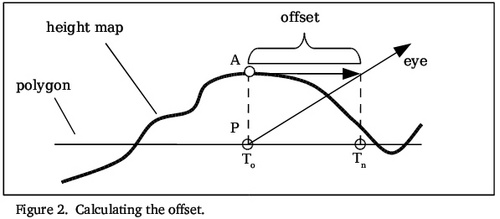

# a

방향과 거리 그리고 파장.

방향, 크기, 마스킹(영역)

- <https://github.com/XJINE/Unity_NormalVisualizerWithGizmo>
- [Low Complexity, High Fidelity: The Rendering of INSIDE](https://www.youtube.com/watch?v=RdN06E6Xn9E)

SAMPLE_DEPTH_TEXTURE(texture, sampler, uv) | half 

물: Reflection(반사),  Distortion(굴절)
// https://darkcatgame.tistory.com/30?category=806332

Fresnel(빛투과), GrabPass + rim

// ex) lerp(grab.rgb, reflect, rim)

Wave(파도), 
normal map, vertex 변형
// ex) vertex.y += sin((abs(v.uv.x + 2 - 1) + 10) + _Time.y + 0.8) * 0.12;
//              += sin((abs(v.uv.y + 2 - 1) + 10) + _Time.y + 0.8) * 0.12;
//                 sin함수대신 texture써도 됨
https://walll4542.wixsite.com/watchthis/post/unityshader-16-urp-shader-graph
이제는 _CameraOpaqueTexture 를 이용하여 표면 아래 땅바닥에 대한 텍스처 자체를 저희가 가지고 있기 때문에 알파를 사용하지 않아도 됩니다.


대표적인 Blend 옵션 조합

|          |                  |                                                |
|----------|------------------|------------------------------------------------|
| SrcAlpha | OneMinusSrcAlpha | Alpha Blend                                    |
| One      | One              | Additive(With out alpha, black is Transparent) |
| SrcAlpha | One              | Additive(With Alpha)                           |
| One      | OneMinusDstColor | Soft Additive                                  |
| DstColor | Zero             | Multiplicative                                 |
| DstColor | SrcColor         | 2x Multiplicative                              |

|                 |               |
|-----------------|---------------|
| 오브젝트 쪼개기 | 노가다..      |
| zwire off       | overdraw 이슈 |
| alpha testing   |               |


흑백테스트
거기다가 아주 흰색을 거의 쓰지 않는다는 것을 유의해야 합니다. UI 등 써야 할 때가 있거든요. 
첨부터 컨트라스트를 쎄게 쓰면 나중에 쓸 밝기가 없어지고 게임이 눈만 아파집니다. 
출처: https://chulin28ho.tistory.com/ [대충 살아가는 게임개발자]


비효과
파티클로 normal맵 - 화면전체 외곡효과 - https://chulin28ho.tistory.com/478


홀로그램효과
float4 fScanLine = tex2D(_MainTex, IN.uv_MainTex * float2(1.0f, 3.0f) + float2(0.0f, _Time.y*0.1f));
https://darkcatgame.tistory.com/15?category=806332  

```
#define SHADOW_COORDS(idx1) float4 _ShadowCoord : TEXCOORD##idx1;
#define TRANSFER_SHADOW(a) a._ShadowCoord = mul( unity_WorldToShadow[0], mul( unity_ObjectToWorld, v.vertex ) );
UNITY_DECLARE_SHADOWMAP(_ShadowMapTexture);
```

FlowMap
- https://github.com/Maujoe/godot-flow-map-shader
- [FLOWMAP PAINTER](http://teckartist.com/?page_id=107)

https://blog.naver.com/dasoong15/221997537161

## TRANSFORM_TEX

#define TRANSFORM_TEX(tex,name) (tex.xy * name##_ST.xy + name##_ST.zw)

name##_ST // for texture space information
|   |            |
|---|------------|
| x | X 기울기값 |
| y | Y 기울기값 |
| z | X 오프셋값 |
| w | Y 오프셋값 |

{텍스처 이름}_TexelSize 는 텍스처의 크기 정보를 가진다.
|   |            |
|---|------------|
| x | 1.0/width  |
| y | 1.0/height |
| z | width      |
| w | height     |


## UNITY_MATRIX_MVP

|                                   |                                  |                                    |
|-----------------------------------|----------------------------------|------------------------------------|
| mul(UNITY_MATRIX_MVP, positionOS) | UnityObjectToClipPos(positionOS) | TransformObjectToHClip(positionOS) |

mul(mul(UNITY_MATRIX_VP, UNITY_MATRIX_M), positionOS) =>
 M * M => M
 M * V => V
 
mul(UNITY_MATRIX_VP, mul(UNITY_MATRIX_M, float4(positionOS, 1.0)))
 M * V = V
 M * V = V

```
#define UNITY_MATRIX_MVP   mul(UNITY_MATRIX_VP, UNITY_MATRIX_M)

float4 TransformObjectToHClip(float3 positionOS)
{
    // More efficient than computing M*VP matrix product
    return mul(GetWorldToHClipMatrix(), mul(GetObjectToWorldMatrix(), float4(positionOS, 1.0)));
}

float4x4 GetWorldToHClipMatrix()
{
    return UNITY_MATRIX_VP;
}
float4x4 GetObjectToWorldMatrix()
{
    return UNITY_MATRIX_M;
}
```

## SRP 

Batcher
|                         |                                  |
|-------------------------|----------------------------------|
| CBUFFER                 | 변화가 필요한 부분               |
| Per Object Large Buffer | GPU메모리에 유지 시키고 싶은놈들 |


|                         |                                                              |
|-------------------------|--------------------------------------------------------------|
| Core.hlsl               | VertexPositionInputs, 스크린 UV, 포그                        |
| Common.hlsl             | 각종 수학관련 구현, Texture유틸, 뎁스계산 등                 |
| Lighting.hlsl           | 라이트구조체, Diffuse, Specular, GI(SH, lightmap)            |
| Shadows.hlsl            | 쉐도우맵 샘플링, 케스케이드 계산, ShadowCoord, Shadow Bias   |
| SpaceTransform.hlsl     | 각종 공간변환 행렬 정의                                      |
| EntityLighting.hlsl     | SH, ProveVolume, Lightmap                                    |
| ImageBasedLighting.hlsl | PBRjcnt IBL관련된 부분(GGX, Anisotropy, ImportanceSample 등) |


|                    |                       |
|--------------------|-----------------------|
| SAMPLE_TEXTURE2D   | tex2D                 |
| SAMPLE_TEXTURE3D   | tex3D                 |
| SAMPLE_TEXCUBE_LOD | texCUBElod  / texCUBE |


|                  |             |
|------------------|-------------|
| UniversalForward | ForwardBase |

## pragma

``` hlsl
// GPU Instancing
#pragma multi_compile_instancing

// Fog
#pragma multi_compile_fog

// Light & Shadow
#pragma multi_compile _ _MAIN_LIGHT_SHADOWS
#pragma multi_compile _ _MAIN_LIGHT_SHADOWS_CASCADE
#pragma multi_compile _ _ADDITIONAL_LIGHTS
#pragma multi_compile _ _ADDITIONAL_LIGHT_SHADOWS
#pragma multi_compile _ _SHADOWS_SOFT

// lightmap
#pragma multi_compile _ DIRLIGHTMAP_COMBINED
#pragma multi_compile _ LIGHTMAP_ON
```

## GPU인스턴싱, SBR Batcher

|  | SBR Batcher                   | GPUu Instancing                                              |
|--|-------------------------------|--------------------------------------------------------------|
|  | 동일한 오브젝트 아니여도 가능 | 동일한 오브젝트 상태                                         |
|  | CBUFFER_START // CBUFFER_END  | UNITY_INSTANCING_BUFFER_START // UNITY_INSTANCING_BUFFER_END |

``` shader
// 안쓰더라도 선언 안해주면, SBR배쳐가 돌지 않음.
CBUFFER_START(UnityPerMaterial)
CBUFFER_END
```

## -

fogCoord
shadowCoord

``` shader
// gpu instance
appdata
{
    UNITY_VERTEX_INPUT_INSTANCE_ID
}

v2f
{
    UNITY_VERTEX_INPUT_INSTANCE_ID
}
```

``` shader
v2f
{
    UNITY_VERTEX_OUTPUT_STEREO
}
```

``` shader
o.positionCS    = TransformObjectToHClip(v.positionOS.xyz);
o.positionWS    = TransformObjectToWorld(v.positionOS.xyz);
o.normalWS      = TransformObjectToWorldNormal(v.normalOS);
o.uv            = TRANSFORM_TEX(v.uv, _MainTex);
o.fogCoord      = ComputeFogFactor(v.vertex.xyz);

// shadow1
o.shadowCoord   = TransformWorldToShadowCoord(o.positionWS);

// shadow2
VertexPositionInputs vertexInput = GetVertexPositionInputs(v.vertex.xyz);
o.shadowCoord = GetShadowCoord(vertexInput);
```

## Light

``` shader
// Lighting.hlsl

struct Light
{
    half3 direction;
    half3 color;
    half distanceAttenuation; //감쇠
    half shadowAttenuation;
}

Light mainLight = GetMainLight(i.shadowCoord);

```

## GI

SampleSH
SAMPLE_GI() 

## additioinal light

uint lightCount = GetAdditionalLightCount();
Light light = GetAdditionalLight(lightIndex, i.positionWS);
diffuse = LigitingLambert(light.Color, light.direction, normal) * light.distanceAttenuation;
specular = LigitingSpecular(color, light.direction, normal, viewDir_Gloss);

GetCameraPositionWS();

## Camera Texture

|                      |                         |
|----------------------|-------------------------|
| _CameraDepthTexture  | Camera.depthTextureMode |
| _CameraOpaqueTexture | GrabPass                |

fixed depth = SAMPLE_DEPTH_TEXTURE(texture, sampler, uv);

``` shader
GrabPass
{
    "_GrabPass"
}
sampler2D _GrabPass
fixed4 fGrapPass = tex2Dproj(_GrabPass, i.screenPosition + 0.5f);
```

## MatCap

MatCap 방식은 한 쪽에서 바라보는 라이팅만 표현이 가능하기 때문에 카메라 각도가 고정되어 있는 경우에만 유효하다는 제약이 있습니다

출처: https://ozlael.tistory.com/41 [오즈라엘]

## UnpackNormal

unitycg.cginc - inline fixed3 UnpackNormal(fixed4 packednormal)
urp ?? - ??


## 물리기반퐁
라포툰lafortune  윌럼스willems 물리기반퐁 1994
Lafortune and Willems 1994
(n + 2) / (2 * PI)

float norm = (_Shiness + 2) / (2 * PI);
float3 specular = norm * pow(specularDot, _Shininess);


## UNITY_INSTANCING_BUFFER

https://www.patreon.com/posts/25418236

``` shader
UNITY_INSTANCING_BUFFER_START(Props)
    UNITY_DEFINE_INSTANCED_PROP(float, _Moved)
UNITY_INSTANCING_BUFFER_END(Props)

float f = UNITY_ACCESS_INSTANCED_PROP(Props, _Moved);
```

``` csharp
MaterialPropertyBlock props = new MaterialPropertyBlock();
props.SetFloat("_Moved", value);
renderer.SetPropertyBlock(props);
renderer.SetPropertyBlock(null);
```


## 쿡토런스 - CookTorrance

``` shader
float sqr(float value)
{
    return value * value;
}

float FresnelSchlick(float value)
{
    float m = clamp(1 - value, 0, 1);
    return pow(m, 5);
}

float G1(float k, float x)
{
    return x / (x * (1 - k) + k);
}

float3 CookTorranceSpec(float NdotL, float LdotH, float NdotH, float NdotV, float roughness, float3 F0)
{
    //D - Normal Distribution Function (GGX)
    float alpha = sqr(roughness);
    float alphaSqr = sqr(alpha);
    float denominator = sqr(NdotH) * (alphaSqr - 1.0f) + 1.0f;
    float D = alphaSqr / (PI * sqr(denominator));

    //F - Fresnel
    float LdotH5 = FresnelSchlick(LdotH);
    float3 F = F0 + (1 - F0) * LdotH5;

    //G - Geometric Attenuation Factor
    float k = sqr(_Roughness + 1) / 8;
    float g1L = G1(k, NdotL);
    float g1V = G1(k, NdotV);
    float G = g1L * g1V;

    float3 specular = NdotL * D * F * G; //책버전
    //float3 specular = max(0.00001f, 4.0f * NdotL * NdotV) * D * F * G; //원래공식
    return specular;
}
```

NDF - 블린 퐁, Beckmann, GGX
GAF - Neumann, Kelemen, Schlick, GGX


// Schlick - https://en.wikipedia.org/wiki/Schlick%27s_approximation

## GGX - “ground glass unknown”

- https://lifeisforu.tistory.com/306


## Fake PBR
[[NDC] 모바일에서 사용 가능한 유니티 커스텀 섭스턴스 PBR 셰이더 만들기](https://www.youtube.com/watch?v=hC62O9NGXEw)

알베도 / 러프니스 / 메탈릭

스펙큘러 / 큐브맵 / 프레넬


- https://github.com/M-Fatah/texture_maker


## 꽃잎이동

버텍스칼라랑 타임값가지고 버텍스 포지션값 변경

## ==================
시차맵핑(parallax mapping)
- offset mapping/ photonic mapping/ virtual displace mapping ...

Normal Mapping은 normal만...
Parallax Mapping은 높이(height)도 활용하여 텍스쳐 좌표보정=> 깊이감 향상

rgb는 Tangent Space Normal값
a  는 Height값

https://catlikecoding.com/unity/tutorials/rendering/part-20/

``` hlsl
float height = SAMPLE_TEXTURE2D(_BumpMap, sampler_BumpMap, IN.uv).w;
float3 V = normalize(GetWorldSpaceViewDir(IN.positionWS));
float2 E = -(V.xy / V.z); // eye
float2 offset = _Parallax * height * E;
float2 uv = IN.uv + offset;
```



==============
Window> Rendering > Lighting> Environment> Envrionment> Skybox Material
Material > Skybox/Cubemap