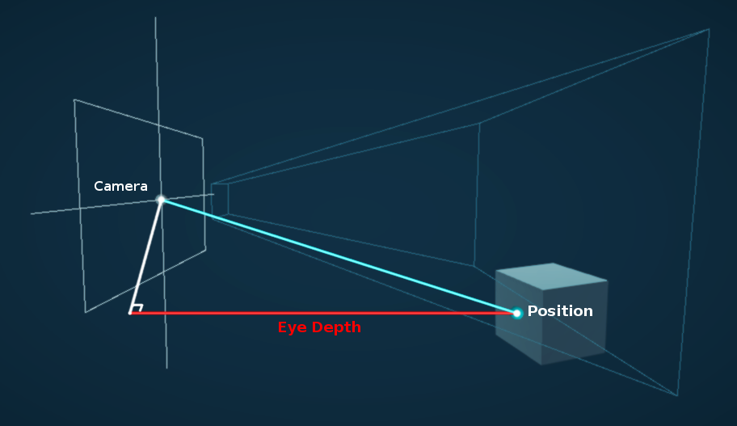
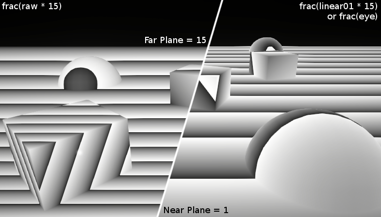

# Depth

- LinearEyeDepth : distance from the eye in world units
- Linear01Depth : distance from the eye in [0;1]

``` hlsl
#include "Packages/com.unity.render-pipelines.universal/ShaderLibrary/DeclareDepthTexture.hlsl"
half3 pd            = IN.positionNDC.xyz / IN.positionNDC.w; // perspectiveDivide
half2 uv_Screen     = pd.xy;

half  sceneRawDepth = SampleSceneDepth(uv_Screen);
half  sceneEyeDepth = LinearEyeDepth(sceneRawDepth, _ZBufferParams);
half  scene01Depth  = Linear01Depth (sceneRawDepth, _ZBufferParams);
```

- [SampleSceneDepth](https://github.com/Unity-Technologies/Graphics/blob/master/com.unity.render-pipelines.universal/ShaderLibrary/DeclareDepthTexture.hlsl)
- [Linear01Depth / LinearEyeDepth](https://github.com/Unity-Technologies/Graphics/blob/master/com.unity.render-pipelines.core/ShaderLibrary/Common.hlsl)

``` hlsl
// mirror: com.unity.render-pipelines.universal/ShaderLibrary/DeclareDepthTexture.hlsl
float SampleSceneDepth(float2 uv)
{
    return SAMPLE_TEXTURE2D_X(_CameraDepthTexture, sampler_CameraDepthTexture, UnityStereoTransformScreenSpaceTex(uv)).r;
}

// mirror: com.unity.render-pipelines.core/ShaderLibrary/Common.hlsl
// Z buffer to linear 0..1 depth (0 at camera position, 1 at far plane).
// Does NOT work with orthographic projections.
// Does NOT correctly handle oblique view frustums.
// zBufferParam = { (f-n)/n, 1, (f-n)/n*f, 1/f }
float Linear01Depth(float depth, float4 zBufferParam)
{
    return 1.0 / (zBufferParam.x * depth + zBufferParam.y);
}

// Z buffer to linear depth.
// Does NOT correctly handle oblique view frustums.
// Does NOT work with orthographic projection.
// zBufferParam = { (f-n)/n, 1, (f-n)/n*f, 1/f }
float LinearEyeDepth(float depth, float4 zBufferParam)
{
    return 1.0 / (zBufferParam.z * depth + zBufferParam.w);
}
```

| [_ZBufferParams](https://docs.unity3d.com/Manual/SL-UnityShaderVariables.html) | x             | y        | z     | w     |
|--------------------------------------------------------------------------------|---------------|----------|-------|-------|
| DirectX                                                                        | -1 + far/near | 1        | x/far | 1/far |
| OpenGL                                                                         | 1 - far/near  | far/near | x/far | y/far |



## depth buffer value non-linear (in view space)



## Sample

``` hlsl
// vert
float currEyeDepth = -positionVS.z;
float curr01Depth = -positionVS.z * _ProjectionParams.w;
float4 positionNDC = GetVertexPositionInputs(positionOS).positionNDC;

// frag
half2 uv_Screen = IN.positionNDC.xy / IN.positionNDC.w;
half sceneRawDepth = SampleSceneDepth(uv_Screen);

// --------------------------------------------
half scene01Depth = Linear01Depth(sceneRawDepth, _ZBufferParams);   //  [near/far, 1]

// -----------------------------------------------
// scene01Depth을 _ProjectionParams.z(far plane)으로 늘리면 sceneEyeDepth
half sceneEyeDepth = scene01Depth * _ProjectionParams.z;            //  [near, far]
half sceneEyeDepth = LinearEyeDepth(sceneRawDepth, _ZBufferParams); //  [near, far]

// -----------------------------------------------
// 물체와의 거리를 빼면, 얼마나 앞에 나와있는지 알 수 있다.
half diffEyeDepth = sceneEyeDepth - IN.currEyeDepth;
half intersectGradient = 1 - min(diffEyeDepth, 1.0f);
```

## Reversed-z

TODO

- <https://developer.nvidia.com/content/depth-precision-visualized>

## ReconstructPositionWS

TODO 둘 중 하나 문제있음

``` hlsl
// https://www.cyanilux.com/tutorials/depth

OUT.toViewVectorWS = _WorldSpaceCameraPos - vertexInputs.positionWS;

float2 screenUV = (IN.positionNDC.xy / IN.positionNDC.w);

float sceneRawDepth = SampleSceneDepth(screenUV);
float sceneEyeDepth = LinearEyeDepth(sceneRawDepth, _ZBufferParams);

float fragmentEyeDepth = -IN.positionVS.z;
float3 scenePositionWS = _WorldSpaceCameraPos + (-IN.toViewVectorWS / fragmentEyeDepth) * sceneEyeDepth;
```

``` hlsl
// https://docs.unity3d.com/Packages/com.unity.render-pipelines.universal@12.0/manual/writing-shaders-urp-reconstruct-world-position.html
float2 screenUV = IN.positionCS.xy / _ScaledScreenParams.xy;

// Sample the depth from the Camera depth texture.
#if UNITY_REVERSED_Z
    real sceneRawDepth = SampleSceneDepth(screenUV);
#else
    // Adjust Z to match NDC for OpenGL ([-1, 1])
    real sceneRawDepth = lerp(UNITY_NEAR_CLIP_VALUE, 1, SampleSceneDepth(screenUV));
#endif

// Reconstruct the world space positions.
float3 scenePositionWS = ComputeWorldSpacePosition(screenUV, sceneRawDepth, UNITY_MATRIX_I_VP);


// https://github.com/Unity-Technologies/Graphics/blob/master/com.unity.render-pipelines.core/ShaderLibrary/Common.hlsl
float3 ComputeWorldSpacePosition(float2 positionNDC, float deviceDepth, float4x4 invViewProjMatrix)
{
    float4 positionCS  = ComputeClipSpacePosition(positionNDC, deviceDepth);
    float4 hpositionWS = mul(invViewProjMatrix, positionCS);
    return hpositionWS.xyz / hpositionWS.w;
}

float4 ComputeClipSpacePosition(float3 position, float4x4 clipSpaceTransform = k_identity4x4)
{
    return mul(clipSpaceTransform, float4(position, 1.0));
}
```

## ReconstructNormalVS

- <https://wickedengine.net/2019/09/22/improved-normal-reconstruction-from-depth/>
- <https://gist.github.com/bgolus/a07ed65602c009d5e2f753826e8078a0>

``` hlsl
// 3 tap
const float2 offset_u = float2(0, _CameraDepthTexture_TexelSize.y); // up
const float2 offset_r = float2(_CameraDepthTexture_TexelSize.x, 0); // right

float depth_c = LinearEyeDepth(SampleSceneDepth(IN.uv           ), _ZBufferParams);  // center
float depth_u = LinearEyeDepth(SampleSceneDepth(IN.uv + offset_u), _ZBufferParams);  // up
float depth_r = LinearEyeDepth(SampleSceneDepth(IN.uv + offset_r), _ZBufferParams);  // right

float3 diff_h = float3(offset_u, depth_u - depth_c);  // horizontal
float3 diff_v = float3(offset_r, depth_r - depth_c);  // vertical

float3 normalVS = normalize(cross(diff_h, diff_v));
```

## Ref

- <https://www.cyanilux.com/tutorials/depth/>
- <https://beta.unity3d.com/talks/Siggraph2011_SpecialEffectsWithDepth_WithNotes.pdf>
- <https://www.reedbeta.com/blog/depth-precision-visualized/>
