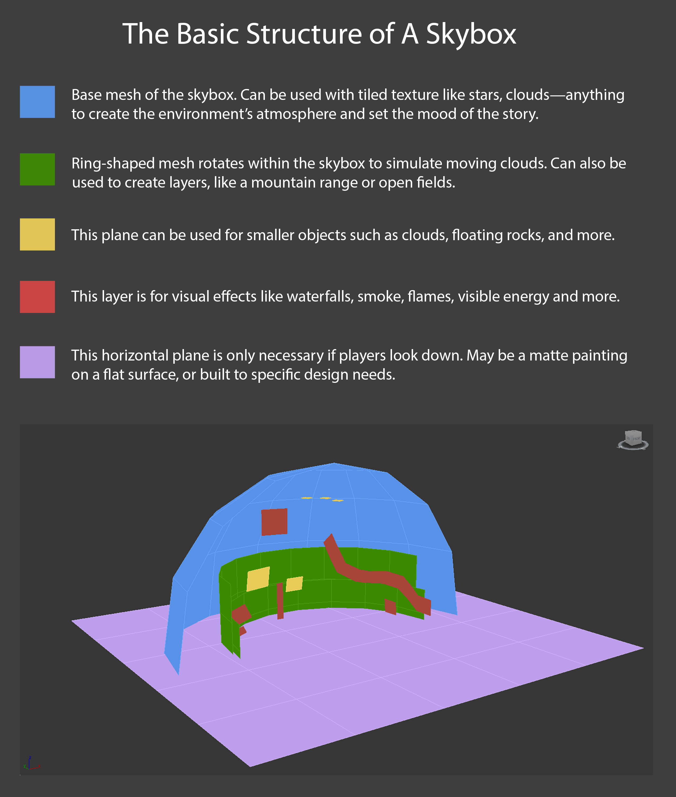

# Sky

돔/스피어를 쓰든 큐브맵을 쓰든 하늘 영역을 일단 SkyBox라 칭하겠다.

- Cubemap
  - 앞뒤좌우/상하 6면을 이용
  - 유니티 Skybox 설정 : `Window > Rendering > Lighting > Environment`
  - Cubemap : `Create > Legacy > Cubemap`
- SkyDome / SkySphere
  - 돔(반구: hemisphere)/구(Sphere) 형태의 매쉬 이용
- 평면
  - <https://developer.arm.com/documentation/102259/0100/Procedural-skybox>
  - 반구를 사용하는대신 뷰방향의 평면을 이용 렌더링 비용 절약

## 구성요소

- 해/달/별/기타 천체
- 구름
- 낮/밤/노을

``` hlsl
// ref: https://developer.arm.com/documentation/102259/0100/Procedural-skybox

half3 _SunPosition;
half3 _SunColor;
half _SunDegree;  // [0.0, 1.0], corresponds to a sun of diameter of 5 degrees: cos(5 degrees) = 0.995

half4 SampleSun(half3 viewDir, half alpha)
{
        // 원형 해
        half sunContribution = dot(viewDir,_SunPosition);

        half sunDistanceFade = smoothstep(_SunDegree - (0.025 * alpha), 1.0, sunContribution);
        half sunOcclusionFade = clamp(0.9 - alpha, 0.0, 1.0);
        half3 sunColorResult = sunDistanceFade * sunOcclusionFade * _SunColor;
        return half4(sunColorResult, 1.0);
}
```

## image

- [How to Create Skies for 3D Games?](https://80.lv/articles/how-to-create-skies-for-3d-games/)

구름을 표현하기 위해 돔형태의 메쉬, 링형 매쉬, 평면 매쉬를 이용했다.




## Sample

``` hlsl
// ref: https://www.slideshare.net/ajinkim/ss-58266584

float VdotUp = max(0, dot(V, float3(0, -1, 0)));
float skyAmount = pow(1.0 - VdotUp, 8.0);

float3 sunset = lerp(_SunsetColor, _SkyColor, saturate(dot(float3(0, 1, 0), _WorldSpaceLightPos0.xyz)));
float3 skyColor = lerp(sunset3, _HorizonColor, skyAmount);
float3 finalSkyColor = lerp(skyColor, _SkyTopColor, VdotUp);

float3 emessive = lerp(_DayColor, _NightColor, _WorldSpaceLightPos0.y);


uv.x = (PI + atan2(positionWS.x, positionWS.z)) / (2 * PI);
uv.y = uv.y * 0.5 + 0.5
```

SunsetColor
SkyColor
HorizonKolor


돔 맵핑
- Alpha Blending 부하
- 반사처리시 Reflection Probe로 부하

  Procedual Sky
구형 택스쳐 맵핑

r 천체
g 상층운
b 중층운
a 하층운


tera
- 백드랍 메쉬
- 천체 매쉬
- 클라우드 매쉬

[Volumetric Clouds – 体积云的做法](http://walkingfat.com/volumetric-clouds-%e4%bd%93%e7%a7%af%e4%ba%91%e7%9a%84%e5%81%9a%e6%b3%95/)

하늘

https://blog.daum.net/darksith/15
https://www.slideshare.net/ajinkim/ss-58266584
https://www.slideshare.net/valhashi/2011-03-gametechtadptforpdf

https://notburning.tistory.com/category/?page=5
https://timcoster.com/2019/09/03/unity-shadergraph-skybox-quick-tutorial/

https://assetstore.unity.com/packages/tools/particles-effects/tenkoku-dynamic-sky-34435
https://assetstore.unity.com/packages/2d/textures-materials/sky/procedural-sky-builtin-lwrp-urp-jupiter-159992
https://assetstore.unity.com/packages/tools/particles-effects/azure-sky-dynamic-skybox-36050

https://www.e2gamedev.com/skybox

- https://www.youtube.com/watch?v=4QOcCGI6xO
- https://github.com/SebLague/Clouds
  - NoiseGenerator

https://github.com/TwoTailsGames/Unity-Built-in-Shaders/blob/master/DefaultResourcesExtra/Skybox-Procedural.shader

[EasySky: Breakdown of a Procedural Skybox for UE4](https://80.lv/articles/easysky-breakdown-of-a-procedural-skybox-for-ue4/)

- [GDC2014  - Moving the Heavens: An Artistic and Technical Look at the Skies of The Last of Us](https://www.youtube.com/watch?v=o66p1QDH7aI)