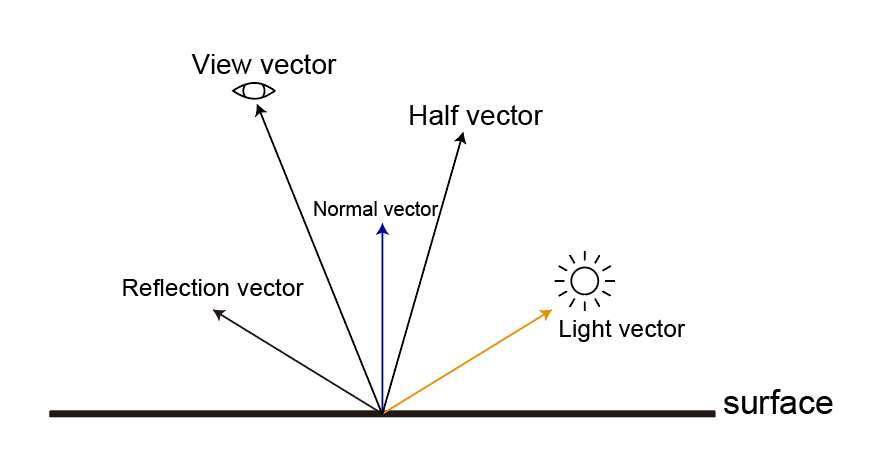

# L, V 방향

빛(L)과 카메라(V)의 방향 부호는 취향에 따라 Vertex를 향하느냐, Vertex에서 나가느냐에 따라 결정된다.

보통 Vertex를 기준으로 나가는 방향을 많이 따른다.

- <https://en.wikipedia.org/wiki/Phong_reflection_model>

## From Vertex (Unity)



``` hlsl
// com.unity.render-pipelines.universal/ShaderLibrary/Lighting.hlsl
light.direction = half3(_MainLightPosition.xyz);

// com.unity.render-pipelines.universal/ShaderLibrary/ShaderVariablesFunctions.hlsl
float3 GetCurrentViewPosition()
{
    return GetCameraPositionWS();
}

float3 GetCameraPositionWS()
{
    return _WorldSpaceCameraPos;
}

float3 GetWorldSpaceViewDir(float3 positionWS)
{
    if (IsPerspectiveProjection())
    {
        // Perspective
        return GetCurrentViewPosition() - positionWS;
    }
    else
    {
        // Orthographic
        return -GetViewForwardDir();
    }
}
```

``` hlsl
L = normalize(lightPositionWS - positionWS);
V = normalize(cameraPositionWS - positionWS);
H = normalize(V + L);
R = reflect(-L, N);

NdotL = dot(N, L);
RdotV = dot(R, V);
```

## To Vertex

Pope 책에서는 Vertex를 향하도록 코드가 작성이 되어있다.


``` hlsl
L = normalize(positionWS - lightPositionWS);
V = normalize(positionWS - cameraPositionWS);
H = normalize((-V) + (-L));
R = reflect(L, N);

NdotL = dot(N, -L);
RdotV = dot(R, -V);
```
