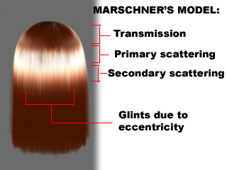
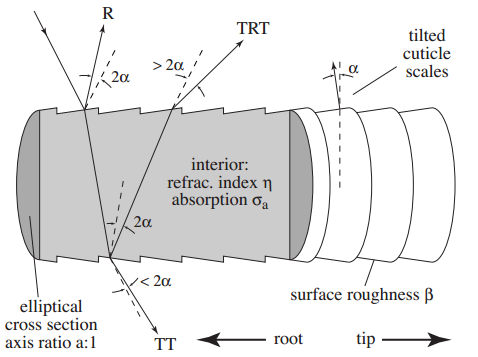

# Hair Anisotropic

``` txt
비등방성(非等方性)(anisotropy)은 방향에 따라 물체의 물리적 성질이 다른 것을 말한다. 
예를 들어, 솔질이 된 알루미늄, 섬유, 옷감, 근육 등의 표면은
들어오는 빛의 방향에 따라 반사율이 다른 광학적 비등방성을 띈다. 
- https://ko.wikipedia.org/wiki/비등방성
```




- [【Unite Tokyo 2018】『崩壊3rd』開発者が語るアニメ風レンダリングの極意](https://youtu.be/ZpWsinhPFLM?t=1285)
- <https://graphics.pixar.com/library/DataDrivenHairScattering/>

## Kajiya-Kay

- [blog - Hair Rendering Lighting Model - (Kajiya-Kay)](https://blog.naver.com/sorkelf/40185948507)

``` hlsl
// Sphere
// T | r | 오른쪽
// B | g | 위쪽
// N | b | 직각

// 논문에서 T. 방향은 머리를향한 위쪽 방향.
// half3 T = normalize(IN.T);

// Sphere에서는 B가 위쪽이므로 B로해야 원하는 방향이 나온다.
half3 T = normalize(IN.B);

sinTH    = sin(T, H) == sqrt(1 - dot(T, H) * dot(T, H))
specular = pow(sinTH, specularPower)
```

## Marschner

- [blog - Hair Rendering Lighting Model - (Marschner)](https://blog.naver.com/sorkelf/40186644136)
- [pdf - Light Scattering from Human Hair Fibers - Stephen R. Marschner, Henrik Wann Jensen, Mike Cammarano](www.cs.cornell.edu/~srm/publications/SG03-hair.pdf)



|     |      |
|-----|------|
| R   | 반사 |
| TRT | 산란 |
| TT  | 투과 |
