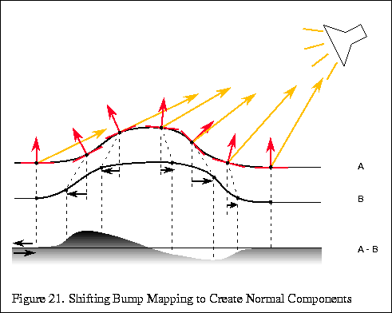

# Parallax Mapping

- parallax mapping, offset mapping, photonic mapping, virtual displace mapping 이라고 부른다.
- 높이 정보를 활용하여 텍스처 좌표를 보정.


- Tangent Space 의 임의의 벡터 x는 `(t, b, n)`의 값을 갖게된다.
- t는 UV.u와 관련있을 것이고, b는 UV.v와 관련이 있게 된다.


``` hlsl
Eye
= -V_TS.tbn / V_TS.n
= -(V_TS.t / V_TS.n,  V_TS.b / V_TS.n, V_TS.n / V_TS.n)
= -(V_TS.t / V_TS.n,  V_TS.b / V_TS.n,               1)
```




``` hlsl
half3x3 TBN = half3x3(normalInputs.tangentWS, normalInputs.bitangentWS, normalInputs.normalWS);

// 시점에 대한 tangent space의 V
OUT.V_TS = mul(TBN, GetCameraPositionWS() - vertexInputs.positionWS);
// 광원 계산을 위한 tangent space의 L
OUT.L_TS = mul(TBN, mainLight.direction);

// OUT.V_TS.t = dot(V, T);
// OUT.V_TS.b = dot(V, B);
// OUT.V_TS.n = dot(V, N);

// OUT.L_TS.t = dot(L, T);
// OUT.L_TS.b = dot(L, B);
// OUT.L_TS.n = dot(L, N);


half2 ParallaxMapping(half2 uv, half3 V_TS)
{
    // 높이 맵에서 높이를 구하고,
    half height = SAMPLE_TEXTURE2D(_NormalDepthPackedTex, sampler_NormalDepthPackedTex, uv).b;

    // 시선에 대한 offset을 구한다.
    // 시선은 반대방향임으로 부호는 마이너스(-) 붙여준다.
    // TS.xyz == TS.tbn
    half2 E = -(V_TS.xy / V_TS.z);

    // 근사값이기에 적절한 strength를 곱해주자.
    return uv + E * (height * _HeightStrength);
}

half3 L_TS = normalize(IN.L_TS);
half3 V_TS = normalize(IN.V_TS);
half2 parallaxUV = ParallaxMapping(IN.uv, V_TS);
if ((parallaxUV.x < 0.0 || 1.0 < parallaxUV.x) || (parallaxUV.y < 0.0 || 1.0 < parallaxUV.y))
{
    // x, y가 범위([0, 1])를 벗어나면 discard.
    discard;
}

// 계산 절약을 위해 `tangent space`기준으로 반사 계산을 한다.
half3 N_TS = UnpackNormal(SAMPLE_TEXTURE2D(_NormalDepthPackedTex, sampler_NormalDepthPackedTex, parallaxUV));
half NdotL = saturate(dot(N_TS, L_TS));

// `world space` 기준이라면 계산이 더 들어가게 된다.
half3 N_TS = UnpackNormal(SAMPLE_TEXTURE2D(_NormalDepthPackedTex, sampler_NormalDepthPackedTex, parallaxUV));
half3 N = mul(normalTex, TBN);
half3 L = mul(L_TS, TBN);
half NdotL = saturate(dot(N, L));
```

- 유니티에도 헬퍼 함수들이 있지만, 별로 추천안함...
  - <https://github.com/Unity-Technologies/Graphics/blob/master/com.unity.render-pipelines.core/ShaderLibrary/ParallaxMapping.hlsl>
  - half4짜리 tangentWS를 원하지 않나... viewDirTS를 다시 normalze하질않나..

## 종류

- Parallax Mapping
- Parallax Mapping with offset limit
- Steep Parallax Mapping
- ReliefParallax
- Parallax Occlusion Mapping (POM)
- ....

## Ref

- <https://learnopengl.com/Advanced-Lighting/Parallax-Mapping>
  - 번역본: <https://gyutts.tistory.com/175>
- [bzyzhang -（三）表面凹凸技术](https://bzyzhang.github.io/2020/11/29/2020-11-29-（三）表面凹凸技术/)
- <http://blog.naver.com/sybershin/129399930>
