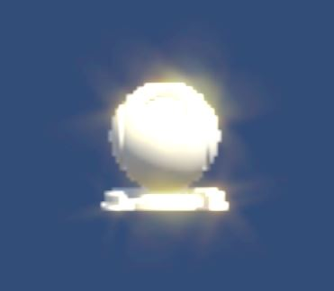

# Bloom

``` txt
- 원본
- 축소 (w/4, h/4)
  - 밝은부분
    - 블러적용
- 원본과 블러적용 더하기
```

- 참조 : [Filter.md](./Filter.md)

## Cross Filter



``` txt
- 원본
- 축소
  - 밝은부분
    - 블러
    - 카메라 기준 6방향 늘이기
    - 늘린것 합치기
- 원본과 합쳐진 늘려진것 더하기
```

| 용도   | 사이즈         | Format                               | 기타                             |
| ------ | -------------- | ------------------------------------ | -------------------------------- |
| 원본   | w, h           |                                      |                                  |
| 축소   | w/4, h/4       | R16G16B16A16                         |                                  |
| 휘도   | w/4 +2, h/4 +2 | R8G8B8A8                             |                                  |
| 블러   | w/4 +2, h/4 +2 | R8G8B8A8                             |                                  |
| 늘리기 | w/4, h/4       | 품질(R16G16B16A16) // 속도(R8G8B8A8) | 6장은 방향늘리기, 2장은 임시버퍼 |

``` txt
cropW = srcW - srcW / Scale
cropH = srcH - srcH / Scale
scaledW = cropW / Scale
scaledH = cropH / Scale
brightW = scaledW + 2;
brightH = scaledH + 2;
```

- Scale을 4로 축소시키면서 축소버퍼의 복사로 픽셀과 텍셀이 1:1 대응함으로 무리없이 복사가능.
- 휘도버퍼에서 패딩은(+2)
  - 블러를 먹이거나 광선을 늘일 경우, 화면을 초과한 픽셀을 검은색으로 처리하기 위한 방법
  - 안하면 텍스쳐 끝부분이 밝으면, 바깥쪽이 모두 밝은것으로 계산되어 필요 이상으로 빛나게됨.

``` cs
public static int ToPow2RoundUp(int x)
{
  if(x == 0)
  {
    return 0;
  }
  return MakeMSB(x - 1) + 1;
}

public static int MakeMSB(int x)
{
  // 0b_0000_0000_0000_0000_1000_0000_1000_1011
  // MakeMSB(0b_1000) => 0b_1111
  // MakeMSB(0b_1111) => 0b_1111

  x |= x >> 1;
  x |= x >> 2;
  x |= x >> 4;
  x |= x >> 8;
  x |= x >> 16;
  return x;
}
```

``` cs
int topBloomWidth = width >> Properties.DownSampleLevel;
int topBloomHeight = height >> Properties.DownSampleLevel;

w = TextureUtil.ToPow2RoundUp( topBloomWidth), 
h = TextureUtil.ToPow2RoundUp( topBloomHeight), 

brightnessOffsetX = (w - topBloomWidth) / 2;
brightnessOffsetY = (h - topBloomHeight) / 2;
```
