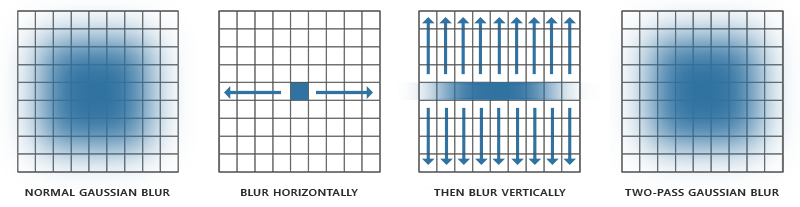

# Filter / Blur

- 포스트프로세스니 ComputeShader와, 어차피 흐려지는 것이니 RenderPipeline을 이용하여 다운샘플링 된걸가지고 하는걸 추천.

``` hlsl
// 조심
// ref: https://docs.unity3d.com/Manual/SL-PlatformDifferences.html
// Flip sampling of the Texture: 
// The main Texture
// texel size will have negative Y).

#if UNITY_UV_STARTS_AT_TOP
if (_MainTex_TexelSize.y < 0)
{
    uv.y = 1-uv.y;
}
#endif
```

## Average / 평균값

- Mean Filter라 불리기도함
  - Median Filter도 있는데, 이는 평균값에 너무 벗어난 값은 포함하지 않음.
- N * N 블럭
- 주변 픽셀들을 더하고 평균값으로 칠함.

``` hlsl
// -1, -1 | 0, -1 | +1, -1
// -1,  0 | 0,  0 | +1,  0
// -1, +1 | 0, +1 | +1, +1

// weight
// 1 | 1 | 1
// 1 | 1 | 1
// 1 | 1 | 1
```

## 16 박스

- 바이너리필터를 이용 4개의 샘플링으로 16개의 텍셀의 평균값을 구함

```txt
/// 16박스
//   .   | 0,-1 |   .  
// -1, 0 |  .   |  1, 0  
//   .   | 0, 1 |   .  

// weight
// 0 | 1 | 0
// 1 | 0 | 1
// 0 | 1 | 0


/// 64박스
// -2,-2 | -1,-2 | 0,-2 | 1,-2
// -2,-1 | -1,-1 | 0,-1 | 1,-1
// -2, 0 | -1, 0 | 0, 0 | 1, 0
// -2, 1 | -1, 1 | 0, 1 | 1, 1

// weight
// 1 | 1 | 1 | 1
// 1 | 1 | 1 | 1
// 1 | 1 | 1 | 1
```

## 9콘 - tent blur

- 바이너리필터를 이용 4개의 샘플링으로 각기다른 가중치를 지닌 9개 텍셀을 얻어옴

``` txt
// 0,  0 | +1,  0
// 0, +1 | +1, +1

// weight
// 1 | 1
// 1 | 1


// 샘플링하면 다음과 같은 9개의 텍셀 가중치를 지니게 된다
// 1 | 2 | 1
// 2 | 4 | 2
// 1 | 2 | 1
```

## Gaussian / 가우스

- N * N 블럭
- 보다 원본 이미지가 잘 살도록, 중심부에 가중치를 더 준다.

``` hlsl
// -1, -1 | 0, -1 | +1, -1
// -1,  0 | 0,  0 | +1,  0
// -1, +1 | 0, +1 | +1, +1

// weight
// Sigma: 1.0 | Kernel Size : 3
// 0.077847 |  0.123317 | 0.077847
// 0.123317 |  0.195346 | 0.123317
// 0.077847 |  0.123317 | 0.077847
```

- [Gaussian Kernel Calculator](http://dev.theomader.com/gaussian-kernel-calculator/)
- <https://www.sysnet.pe.kr/2/0/11623>
- <https://rastergrid.com/blog/2010/09/efficient-gaussian-blur-with-linear-sampling/>

## two-pass Gaussian blur



- <https://learnopengl.com/Advanced-Lighting/Bloom>
- 가로로 한번 블러먹이고
- 세로로 한번 블러먹인다

``` txt
ex)

5x5 = 0.38774 , 0.24477  , 0.06136
9x9 = 0.227027, 0.1945946, 0.1216216, 0.054054, 0.016216
```

## Bilateral / 쌍방

- 엣지를 보존하면서 노이즈를 제거

## Kawase / 카와세

- 대각선을 샘플.

``` hlsl
// -1, -1 |   -   | +1, -1
//    -   | 0,  0 |    -   
// -1, +1 |   -   | +1, +1

// weight
// 1/8 |  -  | 1/8
//  -  | 1/2 |  - 
// 1/8 |  -  | 1/8
```

- <https://github.com/JujuAdams/Kawase>
- [CDEDC2009 -  IMAGIRE DAY : 続・レンダリスト養成講座](https://cedil.cesa.or.jp/cedil_sessions/view/264)
- [GDC2003 - Frame Buffer Postprocessing Effects in DOUBLE-S.T.E.A.L (Wreckless)](http://genderi.org/frame-buffer-postprocessing-effects-in-double-s-t-e-a-l-wreckl.html)
- [GDC2003 - Real-Time 3D Scene Post-processing](https://developer.amd.com/wordpress/media/2012/10/Oat-ScenePostprocessing.pdf)
- https://github.com/nobnak/KawaseLightStreakUnity

## Dual Filter

``` hlsl
// DownSampler pos
// -0.5, -0.5 |   -   | +0.5, -0.5
//    -       | 0,  0 |    -   
// -0.5, +0.5 |   -   | +0.5, +0.5

// DownSampler weight
//   1/8  |   -   |   1/8
//    -   |  1/2  |    - 
//   1/8  |   -   |   1/8

// UpSampler pos
//     -   |     -      |   0, -1   |    -       |    -
//     -   | -0.5, -0.5 |     -     | +0.5, -0.5 |    -
//   -1, 0 |     -      |     -     |    -       |  +1, 0
//     -   | -0.5, -0.5 |     -     | +0.5, -0.5 |    -
//     -   |     -      |   0, +1   |    -       |    -

// UpSampler weight
//     -   |     -      |   1/12    |    -       |    -
//     -   |    1/6     |     -     |    1/6     |    -
//   1/12  |     -      |     -     |    -       |   1/12
//     -   |    1/6     |     -     |    1/6     |    -
//     -   |     -      |   1/12    |    -       |    -
```

- [SIGGRAPH2015 - Bandwidth-Efficient Rendering](https://community.arm.com/cfs-file/__key/communityserver-blogs-components-weblogfiles/00-00-00-20-66/siggraph2015_2D00_mmg_2D00_marius_2D00_notes.pdf)
- <https://github.com/MarcusXie3D/FastBloomForMobiles>
  - <https://zhuanlan.zhihu.com/p/126351976>
- <https://developer.arm.com/documentation/102259/0100/Bloom>
- [Unite Berlin 2018 - Attaining Post Processing Effects on Mid Range Smartphones](https://www.youtube.com/watch?v=7mmWPtAoflI)
  - [slide](https://developer.arm.com/-/media/Files/pdf/graphics-and-multimedia/Unite18_Nordeus_Arm.pdf?revision=3bf9cd9d-08cd-488b-adbd-512899718cba)

## Radial / 방사형

- 중심에서 원형으로 뻗혀나가는 방사형 블러.
- 줌(Zoom)되는 효과
- <https://forum.unity.com/threads/radial-blur.31970/#post-209514>
- <https://blog.naver.com/mnpshino/221478999495>
