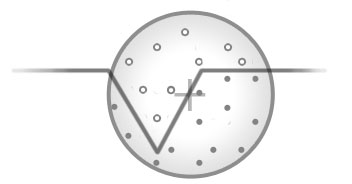
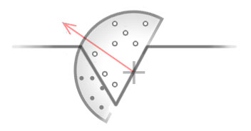

# Screen Space Ambient Occlusion

- 주변물체에 의해서 가려지는 곳이 어둡게 되어, 장면의 깊이감을 더함.
- Ambient : 주변
- Occlusion : 차폐, 가려짐

## 역사

- 2001 : 영화 진주만Pearl Harbor에서 Ambient Occlusion 사용
- 2007 : 게임 Crytek의 Crysis에서 SSAO(Screen Space Ambient Occlusion)등장
  - 실제 지오메트리 데이터를 이용하는게 아니라 화면 공간 뎁스를 이용.
- 2008 : SIGGRAPH2008에서 Nvidia 기존 SSAO개선판 HBAO(Horizon Based Ambient Occulusion)발표.
  - 노멀등 추가정보를 이용.
- 2011 : MSSAO(Multi-Scale Screen Space Ambient Occlusion)
- 2016 : SIGGRAPH2016에서 GTAO(Ground True Ambient Occulusion) 소개.
- ...

## 샘플링 : 구? 반구?



- Sphere - Crysis Method
  - 특정 점의 구형(Sphere) 주변의 뎁스값을 수집 및 계산 => 구형속 뎁스값이 많아지면 어두워짐
  - 구형 주변의 샘플 갯수가 적으면, 정밀도가 줄어들고 소위 (줄무늬가 드리워지는) banding이라는 현상 발생.



- Normal-oriented Hemisphere
  - 특정 점의 노말방향으로 반구형(Hemisphere) 주변의 뎁스값을 수집 및 계산

## 구현

- 반구 주변의 점으로 가려짐 정도(Occlusion factor) 계산
  - 성능상 샘플링 갯수를 줄이는게...
- 계산된 가려짐 정도를 블러(Blur)로 적당히 흐려지게 만들기
- 원본 텍스쳐에 적용

``` hlsl
// 1. 가려짐 정도(Occlusion factor) 계산
// 2. 계산된 가려짐 정도를 블러(Blur)로 적당히 흐려지게 만들기
// 3. 원본 텍스쳐에 적용
half4 mainTex = SAMPLE_TEXTURE2D(_MainTex, sampler_MainTex, IN.uv);
half ambientOcclusionTex = SAMPLE_TEXTURE2D(_AmbientOcclusionTex, sampler_AmbientOcclusionTex, IN.uv).r;
col.rgb *= ambientOcclusionTex;
return col;
```

``` txt
예)

| rt                   | 넓이, 높이 |
| -------------------- | ---------- |
| source               | w, h       |
| _TmpCopy             | w, h       |
| _AmbientOcclusionTex | w/4, h/4   |
| _BlurTex0            | w/8, h/8   |
| _BlurTex1            | w/16, h/16 |

              source,             _TmpCopy : 복사
            _TmpCopy, _AmbientOcclusionTex : Occlusion factor 계산
_AmbientOcclusionTex,            _BlurTex0 : 블러 - DownSampling
           _BlurTex0,            _BlurTex1 : 블러 - DownSampling
           _BlurTex1,            _BlurTex0 : 블러 - UpSampling
           _BlurTex0, _AmbientOcclusionTex : 블러 - UpSampling
            _TmpCopy,               source : 원본 텍스쳐에 적용
```

흠 어차피 블러시킬것이고 채널 하나밖에 안쓰니, (r 혼은 rgb 채널 쓰는) Bloom효과에서 안쓰는 채널(a) 이용하면 괜춘할듯.

## case

``` hlsl
// [assetstore - Fast SSAO ( Mobile , URP , VR , AR , LWRP )](https://assetstore.unity.com/packages/vfx/shaders/fullscreen-camera-effects/fast-ssao-mobile-urp-vr-ar-lwrp-169024)
// 깊이텍스쳐를 이용해서 노말을 구하고, 노말방향으로 레이를 쏴서 AO를 구함.
// 빠름은 1번, 보통은 3번의 occlusion을 구하도록 코드가 작성됨.

float depthDiff = srcDepth - dstDepth;
float occlusion = step(0.02h, depthDiff) * (1.0h - smoothstep(0.02h, _Area, depthDiff));
```

``` hlsl
/// [canny - SSAO (Screen Space Ambient Occlusion)](https://blog.naver.com/canny708/221878564749)
// 중앙점 픽셀로부터 일정 범위 내에 있는 랜덤 위치의 샘플 좌표의 위치 값과 노멀 벡터를 얻어온 후,
// 중앙점의 노멀과 비교하여 각도가 가파를수록, 위치가 가까울수록 차폐의 영향이 크다고 판단.
// depth버퍼로 positionWS랑 normal을 구할 수 있다.

inline float Random(in float2 uv)
{
    // 렌덤텍스쳐 이용하는 방법
    // return SAMPLE_TEXTURE2D(_RandTex, sampler_RandTex, uv).r;

    // 그냥 계산하는 방법
    return frac(sin(dot(uv, float2(12.9898, 78.233))) * 43758.5453);
}

float3 GetWorldSpacePosition(in float2 uv)
{
    float sceneRawDepth = SampleSceneDepth(uv);
    return ComputeWorldSpacePosition(uv, sceneRawDepth, UNITY_MATRIX_I_VP);
}

inline float3 GetNormal(in float2 uv)
{
    return SampleSceneNormals(uv);
}

float3 srcPos = GetWorldSpacePosition(IN.uv);
float3 srcNormal = GetNormal(IN.uv);

const int SAMPLE_COUNT = 32;
float AO = 0;

// 매 계산마다 depth를 불러오니 => 32번 depth를 불러온다
for (int i = 0; i < SAMPLE_COUNT; ++i)
{
    float2 dstUV = IN.uv + (float2(Random(IN.uv.xy + i), Random(IN.uv.yx + i)) * 2 - 1) / _ScreenParams.xy * _Radius;
    float3 dstPos = GetWorldSpacePosition(dstUV);

    float3 distance = dstPos - srcPos;
    float3 direction = normalize(distance);
    float delta = length(distance) * _Scale;

    AO += max(0, dot(srcNormal, direction) - _Bias) * (1 / (1 + delta)) * _Amount;
}

AO /= SAMPLE_COUNT;
AO = 1 - AO;

return half4(AO.xxx, 1);
```

``` glsl
// [(X) SSAO (Screen Space Ambient Occlusion) 처리 기법(소스포함)](http://eppengine.com/zbxe/programmig/2982)
// - backup : https://babytook.tistory.com/158
// 장점 : 따로 blur pass 를 실행할 필요가 없다. ( 랜덤맵 텍스쳐를 활용하기에 가능한 부분)
//        시각적 품질이 나쁘지 않다.
//        노멀 버퍼없이도 깔끔하다.
// 단점 : 전통적 ssao 보다는 좀 느리다.
//        역시 노멀 버퍼를 사용하지 않는 것 으로 인한 약간의 시각적 어색함이 존재.. 약간...
// 

uniform sampler2D som;  // Depth texture 
uniform sampler2D rand; // Random texture
uniform vec2 camerarange = vec2(1.0, 1024.0);

float pw = 1.0/800.0*0.5;
float ph = 1.0/600.0*0.5; 

float readDepth(in vec2 coord) 
{ 
    if (coord.x<0||coord.y<0) return 1.0;
    float nearZ = camerarange.x; 
    float farZ =camerarange.y; 
    float posZ = texture2D(som, coord).x;  
    return (2.0 * nearZ) / (nearZ + farZ - posZ * (farZ - nearZ)); 
}  

float compareDepths(in float depth1, in float depth2,inout int far) 
{ 
    float diff = (depth1 - depth2)*100; //depth difference (0-100)
    float gdisplace = 0.2; //gauss bell center
    float garea = 2.0; //gauss bell width 2

    //reduce left bell width to avoid self-shadowing
    if (diff < gdisplace)
    {
        garea = 0.1;
    }
    else
    {
        far = 1;
    }
    float gauss = pow(2.7182,-2*(diff-gdisplace)*(diff-gdisplace)/(garea*garea));

    return gauss;
} 

float calAO(float depth,float dw, float dh) 
{ 
    float temp = 0;
    float temp2 = 0;
    float coordw = gl_TexCoord[0].x + dw/depth;
    float coordh = gl_TexCoord[0].y + dh/depth;
    float coordw2 = gl_TexCoord[0].x - dw/depth;
    float coordh2 = gl_TexCoord[0].y - dh/depth;

    if (coordw  < 1.0 && coordw  > 0.0 && coordh < 1.0 && coordh  > 0.0)
    {
        vec2 coord = vec2(coordw , coordh);
        vec2 coord2 = vec2(coordw2, coordh2);
        int far = 0;
        temp = compareDepths(depth, readDepth(coord),far);
        //DEPTH EXTRAPOLATION:
        if (far > 0)
        {
            temp2 = compareDepths(readDepth(coord2),depth,far);
            temp += (1.0-temp)*temp2;
        }
    }
    return temp; 
}  

void main(void) 
{ 
    //randomization texture:
    vec2 fres = vec2(20,20);
    vec3 random = texture2D(rand, gl_TexCoord[0].st*fres.xy);
    random = random*2.0-vec3(1.0);

    //initialize stuff:
    float depth = readDepth(gl_TexCoord[0]); 
    float ao = 0.0;

    for(int i=0; i<4; ++i)
    { 
        //calculate color bleeding and ao:
        ao+=calAO(depth,  pw, ph); 
        ao+=calAO(depth,  pw, -ph); 
        ao+=calAO(depth,  -pw, ph); 
        ao+=calAO(depth,  -pw, -ph);

        ao+=calAO(depth,  pw*1.2, 0); 
        ao+=calAO(depth,  -pw*1.2, 0); 
        ao+=calAO(depth,  0, ph*1.2); 
        ao+=calAO(depth,  0, -ph*1.2);

        //sample jittering:
        pw += random.x*0.0007;
        ph += random.y*0.0007;

        //increase sampling area:
        pw *= 1.7;
        ph *= 1.7;
    }        

    //final values, some adjusting:
    vec3 finalAO = vec3(1.0-(ao/32.0));


    gl_FragColor = vec4(0.3+finalAO*0.7,1.0); 
}
```

## Ref

- Game Engine Gems, Volume 1 - 18. Fast Screen-space Ambient Occlusion and Indirect Lighting
- <https://github.com/sebastianhein/urp-ssao>
- <https://learnopengl.com/Advanced-Lighting/SSAO>
- <https://ogldev.org/www/tutorial45/tutorial45.html>
  - <https://ogldev.org/www/tutorial46/tutorial46.html>
- <https://github.com/Unity-Technologies/Graphics/blob/master/com.unity.render-pipelines.universal/ShaderLibrary/SSAO.hlsl>
- [SIGGRAPH2007 -  Finding Next Gen - CryEngine 2](http://developer.amd.com/wordpress/media/2012/10/Chapter8-Mittring-Finding_NextGen_CryEngine2.pdf)
- [GDC2008 - Real-Time Depth Buffer Based Ambient Occlusion](https://developer.download.nvidia.com/presentations/2008/GDC/GDC08_Ambient_Occlusion.pdf)
- [SIGGRAPH2008 - Image-Space Horizon-Based Ambient Occlusion](https://developer.download.nvidia.com/presentations/2008/SIGGRAPH/HBAO_SIG08b.pdf)
- [SIGGRAPH2009 - Multi-LayerDual-ResolutionScreen-SpaceAmbient Occlusion](https://developer.download.nvidia.com/presentations/2009/SIGGRAPH/Bavoil_MultiLayerDualResolutionSSAO.pdf)
- [SIGGRAPH2010 - Rendering techniques in Toy Story 3](https://advances.realtimerendering.com/s2010/)
- [SIGGRAPH2016 - Practical Real-Time Strategies for Accurate Indirect Occlusion](https://blog.selfshadow.com/publications/s2016-shading-course/)
