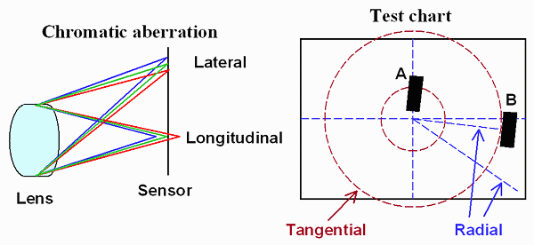

# Chromatic Aberration

- 빛의 파장에 따라 다른 초점 거리를 가짐.
- Chromatic : 색채
- Aberration : 일탈 / 변형



- 종 색수차(Longitudinal/Axial Chromatic Aberration)
- 횡 색수차(Lateral/Yanal Chromatic Aberration)

``` hlsl
// ref: https://github.com/Unity-Technologies/Graphics/blob/master/com.unity.render-pipelines.universal/Shaders/PostProcessing/UberPost.shader

#define DistCenter              _Distortion_Params1.xy
#define DistAxis                _Distortion_Params1.zw
#define DistTheta               _Distortion_Params2.x
#define DistSigma               _Distortion_Params2.y
#define DistScale               _Distortion_Params2.z
#define DistIntensity           _Distortion_Params2.w

#define ChromaAmount            _Chroma_Params.x

float2 DistortUV(float2 uv)
{
    // Note: this variant should never be set with XR
    #if _DISTORTION
    {
        uv = (uv - 0.5) * DistScale + 0.5;
        float2 ruv = DistAxis * (uv - 0.5 - DistCenter);
        float ru = length(float2(ruv));

        UNITY_BRANCH
        if (DistIntensity > 0.0)
        {
            float wu = ru * DistTheta;
            ru = tan(wu) * (rcp(ru * DistSigma));
            uv = uv + ruv * (ru - 1.0);
        }
        else
        {
            ru = rcp(ru) * DistTheta * atan(ru * DistSigma);
            uv = uv + ruv * (ru - 1.0);
        }
    }
    #endif

    return uv;
}

float2 uvDistorted = DistortUV(uv);
half3 color = (0.0).xxx;

float2 coords = 2.0 * uv - 1.0;
float2 end = uv - coords * dot(coords, coords) * ChromaAmount;
float2 delta = (end - uv) / 3.0;

half r = SAMPLE_TEXTURE2D_X(_SourceTex, sampler_LinearClamp, uvDistorted                ).x;
half g = SAMPLE_TEXTURE2D_X(_SourceTex, sampler_LinearClamp, DistortUV(delta + uv)      ).y;
half b = SAMPLE_TEXTURE2D_X(_SourceTex, sampler_LinearClamp, DistortUV(delta * 2.0 + uv)).z;

color = half3(r, g, b);
```

``` hlsl
// ref: [2019 - [Unite Seoul 2019] 최재영 류재성 - 일곱개의 대죄 : "애니메이션의 감성을 그대로"와 "개발 최적화."](https://youtu.be/0LwlNVS3FJo?t=1988)
half3 mainTex = SAMPLE_TEXTURE2D(_MainTex, sampler_MainTex, IN.uv).rgb;
half k = _ParamK;
half kcube = _ParamKcube;

float2 centerUV = (IN.uv - 0.5);
half r2 = dot(centerUV, centerUV);
half f = 0;
if (kcube == 0)
{
    f = 1 + r2 * k;
}
else
{
    f = 1 + r2 * (k + kcube * sqrt(r2));
}

float2 chromaticUV = 0.5 + centerUV * f;
half3 final_chromatic = half3(SAMPLE_TEXTURE2D(_MainTex, sampler_MainTex, chromaticUV).rg, mainTex.b);
```

## Ref

- [The Witcher 3 - Chromatic Aberration](https://www.nvidia.com/en-us/geforce/news/the-witcher-3-wild-hunt-graphics-performance-and-tweaking-guide/#the-witcher-3-wild-hunt-chromatic-aberration)
- [Chromatic Aberration 1 (색수차)](https://mgun.tistory.com/3253)
