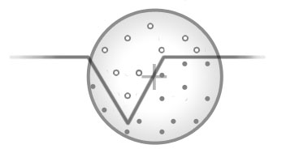

# Screen Space Ambient Occlusion

- 주변물체에 의해서 가려지는 곳이 어둡게 되어, 장면의 깊이감을 더함.
- Ambient : 주변
- Occlusion : 가려짐

## 역사

- 2001 : 영화 진주만Pearl Harbor에서 Ambient Occlusion 사용
- 2007 : 게임 Crytek의 Crysis에서 Screen Space Ambient Occlusion등장
  - 실제 지오메트리 데이터를 이용하는게 아니라 화면 공간 뎁스를 이용.
- 2008 : SIGGRAPH2008에서 Nvidia 기존 SSAO개선판 HBAO(Horizon Based Ambient Occulusion)발표.
  - 노멀등 추가정보를 이용.
- 2016 : SIGGRAPH2016에서 GTAO(Ground True Ambient Occulusion) 소개.
- ...

## 샘플링 : 구? 반구?



- Sphere - Crysis Method
  - 특정 점의 구형(Sphere) 주변의 뎁스값을 수집 및 계산 => 구형속 뎁스값이 많아지면 어두워짐
  - 구형 주변의 샘플 갯수가 적으면, 정밀도가 줄어들고 소위 (줄무늬가 드리워지는) banding이라는 현상 발생.


- Normal-oriented Hemisphere
  - 특정 점의 노말방향으로 반구형(Hemisphere) 주변의 뎁스값을 수집 및 계산

## 구현

- 가려짐 정도(Occlusion factor) 계산
- 계산된 가려짐 정도를 블러(Blur)로 적당히 흐려지게 만들기
- 원본 텍스쳐에 적용

``` hlsl
// 가려짐 정도(Occlusion factor) 계산
현재깊이와 샘플깊이의 관계

- 노말만 이용하는 경우
  - `현재위치`에서 `현재노말`방향으로 뻗어나온, `샘플위치`와 `샘플노멀`을 얻어옴
  - `현재노말`과 `샘플노말`의 각도가 가파를수록, `현재위치`와 `샘플위치`가 가까울수록 차폐의 영향이 크다고 판단
  - <https://blog.naver.com/canny708/221878564749>

??

// 계산된 가려짐 정도를 블러(Blur)로 적당히 흐려지게 만들기
...

// 원본 텍스쳐에 적용
half4 mainTex = SAMPLE_TEXTURE2D(_MainTex, sampler_MainTex, i.uv);
half ambientOcclusionTex = SAMPLE_TEXTURE2D(_AmbientOcclusionTex, sampler_AmbientOcclusionTex, i.uv).r;
col.rgb *= ambientOcclusionTex;
return col;
```

``` txt
예) 블러 - 듀얼필터
| rt                   | 넓이, 높이 |
| -------------------- | ---------- |
| source               | w, h       |
| _TmpCopy             | w, h       |
| _AmbientOcclusionTex | w/4, h/4   |
| _BlurTex0            | w/8, h/8   |
| _BlurTex1            | w/16, h/16 |

              source,             _TmpCopy : 복사
            _TmpCopy, _AmbientOcclusionTex : Occlusion factor 계산
_AmbientOcclusionTex,            _BlurTex0 : 블러 - DownSampling
           _BlurTex0,            _BlurTex1 : 블러 - DownSampling
           _BlurTex1,            _BlurTex0 : 블러 - UpSampling
           _BlurTex0, _AmbientOcclusionTex : 블러 - UpSampling
            _TmpCopy,               source : 원본 텍스쳐에 적용
```


## Ref

- <https://github.com/sebastianhein/urp-ssao>
- <https://learnopengl.com/Advanced-Lighting/SSAO>
- <https://ogldev.org/www/tutorial45/tutorial45.html>
  - <https://ogldev.org/www/tutorial46/tutorial46.html>
- <https://github.com/Unity-Technologies/Graphics/blob/master/com.unity.render-pipelines.universal/ShaderLibrary/SSAO.hlsl>
- [assetstore - Fast SSAO ( Mobile , URP , VR , AR , LWRP )](https://assetstore.unity.com/packages/vfx/shaders/fullscreen-camera-effects/fast-ssao-mobile-urp-vr-ar-lwrp-169024)
- [GDC2008 - Real-Time Depth Buffer Based Ambient Occlusion](https://developer.download.nvidia.com/presentations/2008/GDC/GDC08_Ambient_Occlusion.pdf)
- [SIGGRAPH2008 - Image-Space Horizon-Based Ambient Occlusion](https://developer.download.nvidia.com/presentations/2008/SIGGRAPH/HBAO_SIG08b.pdf)
- [SIGGRAPH2009 - Multi-LayerDual-ResolutionScreen-SpaceAmbient Occlusion](https://developer.download.nvidia.com/presentations/2009/SIGGRAPH/Bavoil_MultiLayerDualResolutionSSAO.pdf)
- [SIGGRAPH2010 - Rendering techniques in Toy Story 3](https://advances.realtimerendering.com/s2010/)
- [SIGGRAPH2016 - Practical Real-Time Strategies for Accurate Indirect Occlusion](https://blog.selfshadow.com/publications/s2016-shading-course/)
