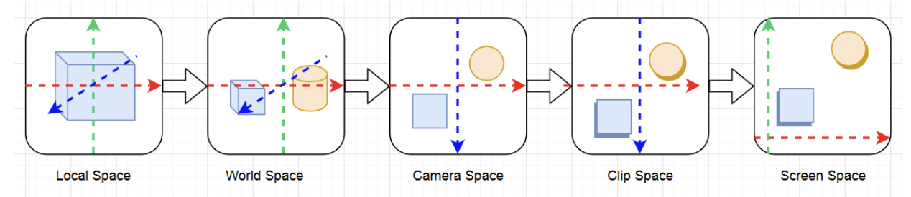

# Transform



| 줄인말 | 공간                                     | 다른말           | 타입   | 설명                             |
|--------|------------------------------------------|------------------|--------|----------------------------------|
| OS     | Object Space                             | Local Space      | float3 |                                  |
| WS     | World Space                              | Global Space     | float3 |                                  |
| VS     | View Space                               | Eye/Camera Space | float3 | 카메라에서 바라볼때              |
| CS     | Homogeneous Clip Space                   |                  | float4 | 카메라 시야에서 안보인 것은 제외 |
| NDC    | Homogeneous Normalized Device Coordinate | Screen Space     | float4 | 2D 화면                          |

``` txt
UNITY_MATRIX_M == renderer.localToWorldMatrix
  - 유니티 4까지는 GPU에 넘겨주기전에 스케일을 가공 - transform.localToWorldMatrix, renderer.localToWorldMatrix가 달랐으나 지금은 같음.
UNITY_MATRIX_V == camera.worldToCameraMatrix
UNITY_MATRIX_P == GL.GetGPUProjectionMatrix(camera.projectionMatrix, false);
```

``` txt
OS
 | UNITY_MATRIX_M * OS
WS
 | UNITY_MATRIX_V * WS
VS
 | UNITY_MATRIX_P * VS
CS
 | NDC = CS * 0.5
 | NDC.x = NDC.x + NDC.w
 | NDC.y =  NDC.y + NDC.w // DirectX
 | NDC.y = -NDC.y + NDC.w // OpenGL
 | NDC.zw = CS.zw
NDC
```

``` hlsl
// com.unity.render-pipelines.universal/ShaderLibrary/Core.hlsl
struct VertexPositionInputs
{
    float3 positionWS; // World space position
    float3 positionVS; // View space position
    float4 positionCS; // Homogeneous clip space position
    float4 positionNDC;// Homogeneous normalized device coordinates
};


// com.unity.render-pipelines.universal/ShaderLibrary/ShaderVariablesFunctions.hlsl
VertexPositionInputs GetVertexPositionInputs(float3 positionOS)
{
    VertexPositionInputs input;
    input.positionWS = TransformObjectToWorld(positionOS);      // UNITY_MATRIX_M
    input.positionVS = TransformWorldToView(input.positionWS);  // UNITY_MATRIX_V
    input.positionCS = TransformWorldToHClip(input.positionWS); // UNITY_MATRIX_VP

    float4 ndc = input.positionCS * 0.5f;
    input.positionNDC.xy = float2(ndc.x, ndc.y * _ProjectionParams.x) + ndc.w;
    input.positionNDC.zw = input.positionCS.zw;

    return input;
}

// com.unity.render-pipelines.core/ShaderLibrary/SpaceTransforms.hlsl
TransformObjectToWorld - UNITY_MATRIX_M
TransformWorldToView   - UNITY_MATRIX_V
TransformWorldToHClip  - UNITY_MATRIX_VP
```

## ref

- [Computergrafik - Vorlesung 6 - Coordinate Systems](https://www.youtube.com/watch?v=u_qKLcszwXA)
- [Unity - shader의 World matrix(unity_ObjectToWorld)를 수작업으로 구성](https://www.sysnet.pe.kr/2/0/11633)
- [Unity - shader의 Camera matrix(UNITY_MATRIX_V)를 수작업으로 구성](https://www.sysnet.pe.kr/2/0/11692)
- [Unity - unity_CameraWorldClipPlanes 내장 변수 의미](https://www.sysnet.pe.kr/2/0/11697)
- [Unity - shader의 원근 투영(Perspective projection) 행렬(UNITY_MATRIX_P)을 수작업으로 구성](https://www.sysnet.pe.kr/2/0/11695)
- [렌더링 파이프라인의 좌표 공간들](http://rapapa.net/?p=3531)
- [Look At Transformation Matrix in Vertex Shader](https://shahriyarshahrabi.medium.com/look-at-transformation-matrix-in-vertex-shader-81dab5f4fc4)
- [transform.localToWorldMatrix](https://docs.unity3d.com/ScriptReference/Transform-localToWorldMatrix.html)
- [Renderer.localToWorldMatrix](https://docs.unity3d.com/ScriptReference/Renderer-localToWorldMatrix.html)
- [Camera.worldToCameraMatrix](https://docs.unity3d.com/ScriptReference/Camera-worldToCameraMatrix.html)
- [Camera.projectionMatrix](https://docs.unity3d.com/ScriptReference/Camera-projectionMatrix.html)
- [GL.GetGPUProjectionMatrix](https://docs.unity3d.com/ScriptReference/GL.GetGPUProjectionMatrix.html)
