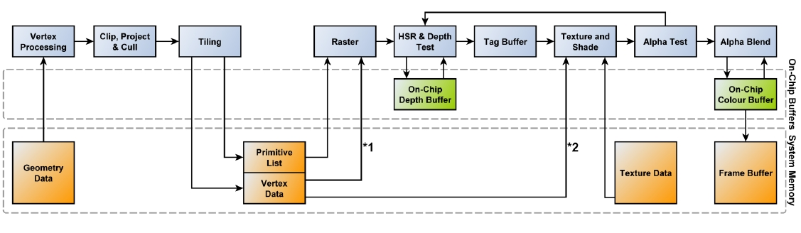

# Alpha

- 알파쓰면 Testing(discard)이나 Blend가 할 것 없이 성능 잡아먹는다.
  - 구형 모바일 디바이스에선 Blend쪽이 성능이 잘 나오는 경향이 있었다.

``` hlsl
SubShader
{
    Tags // SubShader의 Tags는 Pass의 Tags와 다름.
    {
        "RenderPipeline" = "UniversalRenderPipeline"

        // "IgnoreProjector" <<< 요놈은 URP에서 안씀

        // for cutout
        "Queue" = "AlphaTest"              // 렌더순서
        "RenderType" = "TransparentCutout" // 그룹핑(전체 노말맵같이 한꺼번에 바꾸어 그릴때 이용)

        // for blend
        "Queue" = "Transparent"
        "RenderType" = "Transparent"
    }

    Pass
    {
        Tags
        {
            "LightMode" = "UniversalForward"
        }

        // https://docs.unity3d.com/Manual/SL-Blend.html
        Blend A B

        // http://docs.unity3d.com/Manual/SL-CullAndDepth.html
        ZWrite <On | Off> // default: On 
        ZTest <(Less | Greater | LEqual | GEqual | Equal | NotEqual | Always)> // default: LEqual 
    }
}
```

- Blend
  - 색 혼합 방법
- ZWrite
  - Z 값을 기록할지 안할지 결정.
- ZTest
  - Z 값이 씌여져 있는 상태를 읽어서(ZRead), 그려져도 되는지를 결정.


## Alpha Cutout / Alpha Testing

- [clip](https://docs.microsoft.com/en-us/windows/win32/direct3dhlsl/dx-graphics-hlsl-clip)([texkill](https://docs.microsoft.com/en-us/windows/win32/direct3dhlsl/texkill---ps))을 이용
- 간편. sorting걱정 안해도 됨.
- 구형 모바일에서는 AlphaBlend 보다 성능이 안나오는 경향이 있음.
  - 요즘은 AlphaTesting이 더 낳을지도
  - 모바일(A11(ios), PowerVR 등)은 메모리와 대역폭을 줄이기위해 타일별 렌더링을 하는 TBDR(tile-based deferred rendering)을 이용함.
  - 알파테스팅을 이용할시, 실제 보여지는지 여부를 알파테스팅이 끝날때까지 알 수 없으므로 Deffered 최적화를 방해함.
- 풀, 나무, 머리카락, 털 등...
- clip하여 너무 각지는게 보기 싫어질 정도면 blend를 잘 쓰자
- // if ZWrite is Off, clip() is fast enough on mobile, because it won't write the DepthBuffer, so no GPU pipeline stall(confirmed by ARM staff).



``` hlsl
SubShader
{
    Tags // SubShader의 Tags는 Pass의 Tags와 다름.
    {
        "RenderPipeline" = "UniversalRenderPipeline"
        "Queue" = "AlphaTest"
        "RenderType" = "TransparentCutout"
    }

    Pass
    {
        Tags
        {
            "LightMode" = "UniversalForward"
        }

        HLSLPROGRAM
        ...
        half4 frag(VStoFS IN) : SV_Target
        {
            half alpha = ...;
            clip(alpha - _Cutoff);

            return half4(1, 0, 0, 1);
        }
        half4 
        ENDHLSL
    }
}
```

``` hlsl
// URP에선 `_ALPHATEST_ON` 여부로 할지 말지 결정하는 함수가 있다.
// https://github.com/Unity-Technologies/Graphics/blob/master/com.unity.render-pipelines.universal/ShaderLibrary/ShaderVariablesFunctions.hlsl
void AlphaDiscard(real alpha, real cutoff, real offset = real(0.0))
{
    #ifdef _ALPHATEST_ON
        clip(alpha - cutoff + offset);
    #endif
}
```

## Alpha Blend

- 이펙트에서 주로 쓰임
- Alpha Testing보다 디테일 살릴때...
- 불투명 유리

``` hlsl
SubShader
{
    Tags // SubShader의 Tags는 Pass의 Tags와 다름.
    {
        "RenderPipeline" = "UniversalRenderPipeline"
        "Queue" = "Transparent"
        "RenderType" = "Transparent"
    }

    Pass
    {
        ZWrite Off // 픽셀 중복으로 출력됨.
        Blend SrcAlpha OneMinusSrcAlpha

        Tags
        {
            "LightMode" = "UniversalForward"
        }
    }
}
```

- `ZWrite Off` - 뒷면까지 렌더링하는게 문제가됨
  - 2Pass로 보이는면 랜더링

``` hlsl
SubShader
{
    Tags // SubShader의 Tags는 Pass의 Tags와 다름.
    {
        "RenderPipeline" = "UniversalRenderPipeline"
        "Queue" = "Transparent"
        "RenderType" = "Transparent"
    }

    Pass
    {
        Tags
        {
            "LightMode" = "SRPDefaultUnlit"
        }
        ZWrite On
        ColorMask 0 // 색 렌더링 안함
        Cull Front

        HLSLPROGRAM
        ...
        ENDHLSL
    }

    Pass
    {
        Tags
        {
            "LightMode" = "UniversalForward"
        }

        ZWrite Off
        Cull Back
        Blend SrcAlpha OneMinusSrcAlpha

        HLSLPROGRAM
        ...
        ENDHLSL
    }
}

```

## Ref

- [Jihoo Oh - 이펙트 쉐이더 2강 - 알파 / 블랜딩](https://www.slideshare.net/crjl5/2-205467251)
- <https://www.gamedev.net/forums/topic/656826-why-the-alphablend-is-a-better-choice-than-alphatest-to-implement-transparent-on-mobile-device/5154785/>
- [모바일 기기의 Tile Based Rendering(타일 기반 렌더링)과 유니티에서의 주의 사항 #2 : TBR 대응 리소스 제작시 주의점](https://ozlael.tistory.com/24)
- <https://blog.naver.com/dasoong15/221356325748>
- [PowerVR Performance Recommendations The Golden Rules](http://powervr-graphics.github.io/WebGL_SDK/WebGL_SDK/Documentation/Architecture%20Guides/PowerVR%20Performance%20Recommendations.The%20Golden%20Rules.pdf)
- Z 버퍼의 Read / Write 개념 by 김윤정
  - [1부. Z 값과 Z 버퍼](http://chulin28ho.egloos.com/5267860)
  - [2부. 개악마 알파 블렌딩1편](http://chulin28ho.egloos.com/5268685)
  - [3부. 개악마 알파 블렌딩2편](http://chulin28ho.egloos.com/5269434)
  - [4부. 개악마 알파 블렌딩3편](http://chulin28ho.egloos.com/5270691)
  - [5부, 알파 테스팅](http://chulin28ho.egloos.com/5271687)
  - [6부, Z Read/Write](http://chulin28ho.egloos.com/5272883)
  - [7부, Z Read On / Write Off](http://chulin28ho.egloos.com/5284164)
