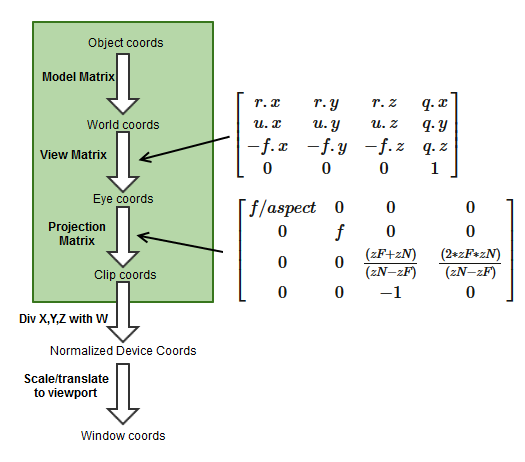
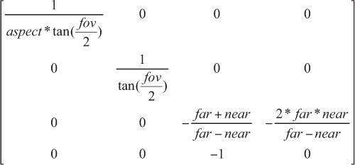

# Coordinate

- 좌표공간


## 유니티 정의 positions

| position    | Space                                    | AKA           | 타입   | 설명                                              |
| ----------- | ---------------------------------------- | ------------- | ------ | ------------------------------------------------- |
| positionOS  | Object                                   | Local / Model | float3 |                                                   |
| positionWS  | World                                    | Global        | float3 |                                                   |
| positionVS  | View                                     | Camera / Eye  | float3 | 카메라에서 바라볼때                               |
| positionCS  | Homogeneous Clip                         |               | float4 | 카메라 시야에서 안보인 것은 제외, Orthogonal 적용 |
| positionNDC | Homogeneous Normalized Device Coordinate |               | float4 | [ 0, w] : (x, y, z, w)                            |

## 내가 임의로 정한것

| 이름 붙여봄 position | Space                                       | 타입   | 설명                                  |
| -------------------- | ------------------------------------------- | ------ | ------------------------------------- |
| ndc                  | Nonhomogeneous Normalized Device Coordinate | float3 | [-1, 1] : PerspectiveDivision * 2 - 1 |
| uv_Screen            | Screen                                      | float2 | [ 0, 1] : PerspectiveDivision         |
| positionScreen       | ViewPort                                    | float2 | [화면 넓이, 화면 높이]                |

## 공간 변환 그림 예

예1)



예2)


## UNITY_MATRIX

| Matrix         | 설명                                                       |
| -------------- | ---------------------------------------------------------- |
| UNITY_MATRIX_M | renderer.localToWorldMatrix                                |
| UNITY_MATRIX_V | camera.worldToCameraMatrix                                 |
| UNITY_MATRIX_P | GL.GetGPUProjectionMatrix(camera.projectionMatrix, false); |

- localToWorldMatrix
  - 유니티 4까지는 GPU에 넘겨주기전에 스케일을 가공하여
  - renderer.localToWorldMatrix, transform.localToWorldMatrix가 달랐으나 지금은 같음.

| 카메라 관련               | 렌더링(UNITY_MATRIX_)의 뷰 전방은 `-z`. 카메라 행렬은 에디터와 동일하게 `+z`를 앞으로 사용 |
| ------------------------- | ------------------------------------------------------------------------------------------ |
| UNITY_MATRIX_V            | cam.worldToCameraMatrix                                                                    |
| unity_WorldToCamera       | Matrix4x4(cam.transform.position, cam.transform.rotation, Vector3.one)                     |
| UNITY_MATRIX_I_V          | cam.cameraToWorldMatrix                                                                    |
| unity_CameraToWorld       | Matrix4x4(cam.transform.position, cam.transform.rotation, Vector3.one).inverse             |
| UNITY_MATRIX_P            | GL.GetGPUProjectionMatrix(camera.projectionMatrix, false)                                 |
| unity_CameraProjection    | cam.projectionMatrix                                                                       |
| UNITY_MATRIX_I_P          | GL.GetGPUProjectionMatrix(camera.projectionMatrix, false).inverse                          |
| unity_CameraInvProjection | cam.projectionMatrix.inverse                                                               |

``` txt
OS  ----------------------- Object Space
 | UNITY_MATRIX_M * OS
WS  ----------------------- World Space
 | UNITY_MATRIX_V * WS
VS  ----------------------- View Space
 | UNITY_MATRIX_P * VS
CS  ----------------------- Homogeneous Clip Space
 | NDC    = CS * 0.5
 | NDC.x  =  NDC.x + NDC.w
 | NDC.y  =  NDC.y + NDC.w // DirectX
 | NDC.y  = -NDC.y + NDC.w // OpenGL
 | NDC.zw = CS.zw
NDC ---------------------- Homogeneous Normalized Device Coordinate [0..w]
 | pd = (NDC.xyz / NDC.w); // [0, 1] : perspective divide
 | ndc = pd * 2.0 - 1.0;   // [-1, 1]
ndc ---------------------- Nonhomogeneous Normalized Device Coordinate [-1..1]
```

``` hlsl
// com.unity.render-pipelines.universal/ShaderLibrary/Core.hlsl
struct VertexPositionInputs
{
    float3 positionWS; // World space position
    float3 positionVS; // View space position
    float4 positionCS; // Homogeneous clip space position
    float4 positionNDC;// Homogeneous normalized device coordinates
};

// com.unity.render-pipelines.universal/ShaderLibrary/ShaderVariablesFunctions.hlsl
VertexPositionInputs GetVertexPositionInputs(float3 positionOS)
{
    VertexPositionInputs input;
    input.positionWS = TransformObjectToWorld(positionOS);      // UNITY_MATRIX_M
    input.positionVS = TransformWorldToView(input.positionWS);  // UNITY_MATRIX_V
    input.positionCS = TransformWorldToHClip(input.positionWS); // UNITY_MATRIX_VP

    float4 ndc = input.positionCS * 0.5f;
    input.positionNDC.xy = float2(ndc.x, ndc.y * _ProjectionParams.x) + ndc.w;
    input.positionNDC.zw = input.positionCS.zw;

    return input;
}

// com.unity.render-pipelines.core/ShaderLibrary/SpaceTransforms.hlsl
TransformObjectToWorld - UNITY_MATRIX_M
TransformWorldToView   - UNITY_MATRIX_V
TransformWViewToHClip  - UNITY_MATRIX_P
TransformWorldToHClip  - UNITY_MATRIX_VP
```

| [_ProjectionParams](https://docs.unity3d.com/Manual/SL-UnityShaderVariables.html) | x   | y          | z         | w            |
| --------------------------------------------------------------------------------- | --- | ---------- | --------- | ------------ |
| DirectX                                                                           | 1   | near plane | far plane | 1 / farplane |
| OpenGL                                                                            | -1  | near plane | far plane | 1 / farplane |


|         | UNITY_REVERSED_Z | UNITY_NEAR_CLIP_VALUE | UNITY_RAW_FAR_CLIP_VALUE |
| ------- | ---------------- | --------------------- | ------------------------ |
| DirectX | 1                | 1                     | 0                        |
| Vulkan  | 1                | 1                     | 0                        |
| OpenGL  | 0                | -1                    | 1                        |

## NDC

``` hlsl
// [0, w] // Homogeneous Normalized Device Coordinate
float4 positionNDC = GetVertexPositionInputs(positionOS).positionNDC;

// [0, 1] // Perspective Division
float3 pd = positionNDC.xyz / positionNDC.w;

// [-1, 1] // Nonhomogeneous Normalized Device Coordinate
float3 ndc = pd * 2.0 - 1.0;

// [0, 1]
float2 uv_Screen = positionNDC.xy / positionNDC.w;

// [0, screenWidth] / [0, screenHeight]
float2 positionScreen = uv_Screen * _ScreenParams.xy;
```

``` hlsl
// float4 ndc = input.positionCS * 0.5f;
// input.positionNDC.xy = float2(ndc.x, ndc.y * _ProjectionParams.x) + ndc.w;
// input.positionNDC.zw = input.positionCS.zw;
NDC = float4(
    (0.5 * CS.x                       ) + 0.5 * CS.w,
    (0.5 * CS.y *  _ProjectionParams.x) + 0.5 * CS.w,
    CS.z,
    CS.w
);

// pd = NDC.xyz / NDC.w
pd = float3(
    (0.5 * CS.x                        / CS.w) + 0.5,
    (0.5 * CS.y *  _ProjectionParams.x / CS.w) + 0.5,
    CS.z / CS.w
);

// ndc = pd * 2 - 1
ndc = float3(
    (CS.x                       / CS.w),
    (CS.y * _ProjectionParams.x / CS.w),
    (CS.z                       / CS.w) * 2  - 1,
);

// uv_Screen = NDC.xy / NDC.w
uv_Screen = float2(
    (CS.x                       / CS.w),
    (CS.y * _ProjectionParams.x / CS.w)
);

// positionScreen = uv_Screen * _ScreenParams.xy
positionScreen = float2(
    (CS.x                       / CS.w) * _ScreenParams.x,
    (CS.y * _ProjectionParams.x / CS.w) * _ScreenParams.y
);
```

## Normal

- [./NormalMap.md](./NormalMap.md)

## Pserspective Camera

- <https://chengkehan.github.io/ReconstructPositionFromDepth.html>



``` cs
// Find our current location in the camera's projection space.
Vector3 pt = Camera.main.projectionMatrix.MultiplyPoint(transform.position);

// Matrix4x4.MultiplyPoint
public Vector3 MultiplyPoint(Matrix4x4 mat, Vector3 v)
{
    Vector3 result;
    result.x = mat.m00 * v.x + mat.m01 * v.y + mat.m02 * v.z + mat.m03;
    result.y = mat.m10 * v.x + mat.m11 * v.y + mat.m12 * v.z + mat.m13;
    result.z = mat.m20 * v.x + mat.m21 * v.y + mat.m22 * v.z + mat.m23;
    float num = mat.m30 * v.x + mat.m31 * v.y + mat.m32 * v.z + mat.m33;
    num = 1 / num;
    result.x *= num;
    result.y *= num;
    result.z *= num;
    return result;
}

// z값 구하지 않으면
public Vector3 MultiplyPoint(Matrix4x4 mat, Vector3 v)
{
    Vector3 result;
    result.x = mat.m00 * v.x + mat.m01 * v.y + mat.m02 * v.z + mat.m03;
    result.y = mat.m10 * v.x + mat.m11 * v.y + mat.m12 * v.z + mat.m13;
    float num = mat.m30 * v.x + mat.m31 * v.y + mat.m32 * v.z + mat.m33;
    num = 1 / num;
    result.x *= num;
    result.y *= num;
    return result;
}

// 값을 대입하면
public Vector3 MultiplyPoint(Matrix4x4 mat, Vector3 v)
{
    Vector3 result;
    result.x = mat.m00 * v.x + 0 * v.y + 0 * v.z + 0;
    result.y = 0 * v.x + mat.m11 * v.y + 0 * v.z + 0;
    float num = 0 * v.x + 0 * v.y + -1 * v.z + 0;
    num = 1 / num;
    result.x *= num;
    result.y *= num;
    return result;
}

// 최종적으로
public Vector3 MultiplyPoint(Matrix4x4 mat, Vector3 v)
{
    Vector3 result;
    result.x = mat.m00 * v.x;
    result.y = mat.m11 * v.y;
    float num = -1 * v.z;
    num = 1 / num;
    result.x *= num;
    result.y *= num;
    return result;
}

(X, Y, linearEyeDepth)
positionNDC // [-1, 1]
X = positionNDC.x * linearEyeDepth / mat.m00
Y = positionNDC.x * linearEyeDepth / mat.m11


The zero-based row-column position:
|  _m00, _m01, _m02, _m03 |
|  _m10, _m11, _m12, _m13 |
|  _m20, _m21, _m22, _m23 |
|  _m30, _m31, _m32, _m33 |

The one-based row-column position:
|   _11,  _12,  _13,  _14 |
|   _21,  _22,  _23,  _24 |
|   _31,  _32,  _33,  _34 |
|   _41,  _42,  _43,  _44 |

```

## UV

texel(TExture + piXEL) coordinate

``` txt
Direct X
(0,0)            (1,0)
  +-------+-------+
  |       |       |
  |       |       |
  +-------+-------+
  |       |       |
  |       |       |
  +-------+-------+
(0,1)            (1,1)


OpenGL / UnityEngine
(0,1)            (1,1)
  +-------+-------+
  |       |       |
  |       |       |
  +-------+-------+
  |       |       |
  |       |       |
  +-------+-------+
(0,0)            (1,0)
```

- 수학적으로 바라보면 모든 2D좌표계를 OpenGL방식으로하면 좌표계를 헷갈릴 걱정이 없다. 하지만, 프로그래밍 하는 입장에서는 DirectX방식이 좀 더 와닿을 것이다.

## Ref

- [Computergrafik - Vorlesung 6 - Coordinate Systems](https://www.youtube.com/watch?v=u_qKLcszwXA)
- [Unity - shader의 World matrix(unity_ObjectToWorld)를 수작업으로 구성](https://www.sysnet.pe.kr/2/0/11633)
- [Unity - shader의 Camera matrix(UNITY_MATRIX_V)를 수작업으로 구성](https://www.sysnet.pe.kr/2/0/11692)
- [Unity - unity_CameraWorldClipPlanes 내장 변수 의미](https://www.sysnet.pe.kr/2/0/11697)
- [Unity - shader의 원근 투영(Perspective projection) 행렬(UNITY_MATRIX_P)을 수작업으로 구성](https://www.sysnet.pe.kr/2/0/11695)
- [렌더링 파이프라인의 좌표 공간들](http://rapapa.net/?p=3531)
- [Look At Transformation Matrix in Vertex Shader](https://shahriyarshahrabi.medium.com/look-at-transformation-matrix-in-vertex-shader-81dab5f4fc4)
- [transform.localToWorldMatrix](https://docs.unity3d.com/ScriptReference/Transform-localToWorldMatrix.html)
- [Renderer.localToWorldMatrix](https://docs.unity3d.com/ScriptReference/Renderer-localToWorldMatrix.html)
- [Camera.worldToCameraMatrix](https://docs.unity3d.com/ScriptReference/Camera-worldToCameraMatrix.html)
- [Camera.projectionMatrix](https://docs.unity3d.com/ScriptReference/Camera-projectionMatrix.html)
- [GL.GetGPUProjectionMatrix](https://docs.unity3d.com/ScriptReference/GL.GetGPUProjectionMatrix.html)
- <http://blog.hvidtfeldts.net/index.php/2014/01/combining-ray-tracing-and-polygons/>
