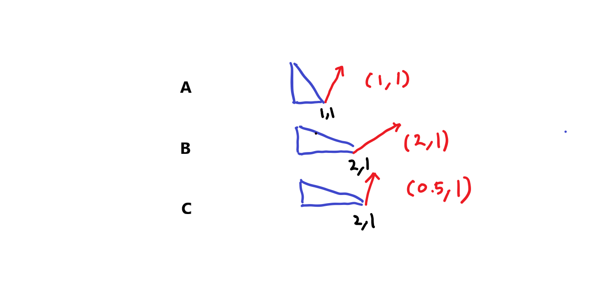
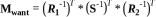

# NormalMap

``` hlsl
inline void ExtractTBN(in half3 normalOS, in float4 tangent, inout half3 T, inout half3  B, inout half3 N)
{
    N = TransformObjectToWorldNormal(normalOS);
    T = TransformObjectToWorldDir(tangent.xyz);
    B = cross(N, T) * tangent.w * unity_WorldTransformParams.w;
}

inline half3 CombineTBN(in half3 tangentNormal, in half3 T, in half3  B, in half3 N)
{
    return mul(tangentNormal, float3x3(normalize(T), normalize(B), normalize(N)));
}

Varyings vert(Attributes IN)
{
    ExtractTBN(IN.normalOS, IN.tangent, OUT.T, OUT.B, OUT.N);
}

half4 frag(Varyings IN) : SV_Target
{
    half3 normalTex = UnpackNormal(SAMPLE_TEXTURE2D(_NormalTex, sampler_NormalTex, IN.uv));
    half3 N = CombineTBN(normalTex, IN.T, IN.B, IN.N);
}
```

- NormalMap(법선맵)을 쓰는 이유?
- TBN이란?
- world-Normal 구하는 법?
- 노말맵 혹은 법선맵(tangent space)에서 g채널을 뒤집는 이유?

## 법선맵을 쓰는 이유

- 정점(vertex)을 많이 밖아서 디테일을 표시하면, 실시간으로 정점을 처리하는데 부하가 걸린다(주로 CPU).
- 셰이더 계산시 법선맵에서 가상의 정점을 생성해 빛을 계산하면 디테일을 살릴 수 있다.

## Object Space vs Tangent Space

- 리깅을 사용하는 모델의 경우 정점이 몰핑되면서 노말 벡터의 방향이 바뀌게 되는데 이때는 고정된 오브젝트 의 공간좌표계는 의미가 없어짐.

## TBN

| TBN        | Source      | xyz | UV |
|------------|-------------|-----|----|
| `T`angent  | TANGENT     | x   | u  |
| `B`inormal | cross(T, N) | y   | v  |
| `N`ormal   | NORMAL      | z   |    |

``` shader
N = mul(mat_I_M, normalOS);
T = mul(tangentOS, mat_M);
B = mul(binormalOS, mat_M);
// unity같이 binormalOS를 못어올 경우 N, T를 이용하여 B를 만들 수 있다.
// B = cross(N, T) * tangentOS.w

======== 월드공간 T / B / N 을 구하고 TBN매트릭스(tangent -> world)를 만든다
float3x3 TBN_Tangent2World = float3x3(normalize(Input.T), normalize(Input.B), normalize(Input.N));
| Tx Ty Tz |
| Bx By Bn |
| Nx Ny Nz |

mul(tangentNormal, TBN_Tangent2World);   // 왠지 이케 해버리면 앞서 말한 NormalScaleProblem에 걸릴것 같음


======== TBN은 직교행렬, 직교행렬의 역행렬은 전치행렬.
TBN_World2Tangent = transpose(TBN_Tangent2World);
| Tx Bx Nx |
| Ty By Ny |
| Yz Bz Nz |

mul(TBN_World2Tangent, tangentNormal);   // 이케하면 되겠지?

======== 뇌피셜
// 위에꺼도 맞긴 맞는데...
// TBN은 직교행렬, 직교행렬의 역행렬은 전치행렬.
// traspose(inverse(M)) == M
mul(tangentNormal, TBN_Tangent2World);  // 따라서 이케해도 문제될꺼 없음? 확인해봐야함
```

## normal flatten

``` hlsl

//                               T, B, N
const float3 vec_TBN_UP = float3(0, 0, 1);

normalTS = lerp(normalTS, vec_TBN_UP, _Flatteness);
```

## Block Compression

- <https://docs.microsoft.com/en-us/windows/win32/direct3d10/d3d10-graphics-programming-guide-resources-block-compression#bc3>

|        |                                   |              |
|--------|-----------------------------------|--------------|
| DXT5   | BC3 format                        | (x, y, 0, 1) |
| DXT5nm | DXT5의 R채널값이 A채널로 이동된것 | (1, y, 0, x) |

| BC3 | channel       | bit |
|-----|---------------|-----|
| x   | a0, a1        | 16  |
|     | alpha indices | 48  |
| y   | color0,1      | 32  |
|     | color indices | 32  |


| BC5 | channel       | bit |
|-----|---------------|-----|
| x   | r0, r1        | 16  |
|     | red indices   | 48  |
| y   | g0, g1        | 32  |
|     | green indices | 32  |


### UNITY_NO_DXT5nm

DXT5nm이 아닌 경우(UNITY_NO_DXT5nm) 는 다음과 같은 공식을 썼으나,

``` shader
real3 UnpackNormalRGBNoScale(real4 packedNormal)
{
    return packedNormal.rgb * 2.0 - 1.0;
}
```

아닌경우 UnpackNormalmapRGorAG을 사용 DXT5, DXT5nm을 처리할 수 있게한다.

``` hlsl
real3 UnpackNormal(real4 packedNormal)
{
#if defined(UNITY_ASTC_NORMALMAP_ENCODING)
    return UnpackNormalAG(packedNormal, 1.0);
#elif defined(UNITY_NO_DXT5nm)
    return UnpackNormalRGBNoScale(packedNormal);
#else
    // Compiler will optimize the scale away
    return UnpackNormalmapRGorAG(packedNormal, 1.0);
#endif
}

// Unpack normal as DXT5nm (1, y, 0, x) or BC5 (x, y, 0, 1)
real3 UnpackNormalmapRGorAG(real4 packedNormal, real scale = 1.0)
{
    // Convert to (?, y, 0, x)
    packedNormal.a *= packedNormal.r;
    return UnpackNormalAG(packedNormal, scale);
}

real3 UnpackNormalAG(real4 packedNormal, real scale = 1.0)
{
    real3 normal;
    normal.xy = packedNormal.ag * 2.0 - 1.0;
    normal.z = max(1.0e-16, sqrt(1.0 - saturate(dot(normal.xy, normal.xy))));

    // must scale after reconstruction of normal.z which also
    // mirrors UnpackNormalRGB(). This does imply normal is not returned
    // as a unit length vector but doesn't need it since it will get normalized after TBN transformation.
    // If we ever need to blend contributions with built-in shaders for URP
    // then we should consider using UnpackDerivativeNormalAG() instead like
    // HDRP does since derivatives do not use renormalization and unlike tangent space
    // normals allow you to blend, accumulate and scale contributions correctly.
    normal.xy *= scale;
    return normal;
}
```

- xyzw, wy => _g_r => rg => xyn // r이 뒤로 있으므로, 한바퀴 돌려줘야함.
- `normal.xy = packednormal.wy * 2 - 1;` (0 ~ 1 => -1 ~ 1)
- `Z`는 쉐이더에서 계산. 단위 벡터의 크기는 1인것을 이용.(sqrt(x^2 + y^2 + z^2) = 1) `sqrt(1 - saturate(dot(normal.xy, normal.xy)))`

## Normal Scale Problem

- [Normal Transformation](https://paroj.github.io/gltut/Illumination/Tut09%20Normal%20Transformation.html)

오브젝트를 스케일시킬때 Normal의 변화의 문제

A라는 도형을 x에 대해서 2만큼 스케일 업하고 싶다고 가정하면,

|   | 정점   | x 스케일 | 노말     |
|---|--------|----------|----------|
| A | (1, 1) | 1        | (1, 1)   |
| B | (2, 1) | 2        | (2, 1)   |
| C | (2, 1) | 2        | (0.5, 1) |



C처럼 x의 스케일 2배 됐다고, 노멀의 x값에 `곱하기` 2를 해서는 안된다. 역인 `나누기` 2 를 해야한다.

위치(position)에 대해서는 `world-Position = mul(obj-Position, M )`이 정상적으로 성립되었다.

하지만, `world-Normal = mul( obj-Normal, M )` 처럼 적용했을시 앞+선 `B`와 같은 문제가 발생한다.

월드행렬(M)식으로 나타내면


우리가 구하고 싶은 행렬을 M-want라 했을시 `world-Normal = mul(M-want, obj-Normal)`





즉 `M-want     = traspose(inverse(M))`.

DirectX기준 `row-major`에서의 메트릭스와 벡터의 인자 순서: `mul(벡터, 메트릭스) =  mul( transpose(메트릭스), 벡터 )`

아레 예는 `row-major` 기준으로 작성.

``` formula
M          = ObjectToWorld
inverse(M) = WorldToObject
M-want     = traspose(inverse(M))

world-Normal
= mul(obj-Normal   , M-want              )
= mul(obj-Normal   , traspose(inverse(M)))
= mul(inverse(M)   , obj-Normal          )
= mul(WorldToObject, obj-Normal          )
```

## 노말맵 혹은 법선맵(tangent space)에서 g채널을 뒤집는 이유

- [pope - 노말맵은 왜 파란가?](https://www.youtube.com/watch?v=Y3rn-4Nup-E)
- <https://victorkarp.wordpress.com/2020/06/26/inverting-a-normal-map-in-blender/>

- 단위벡터의 크기가 1이지만, (-1, 0, 0)과 같은게 있으므로, 정규화된 법선벡터의 범위는 `-1...1`이다.
- 바이너리로 저장하기위해 범위를 `0...1`로 줄이려면 0.5를 곱하고 다시 0.5를 더해주면 된다.
- 셰이더에서 저장된 범위 `0...1`을 `-1...1`로 확장시키려면 2를 곱하고 1을 빼주면 `-1...1`의 범위로 확장된다.

노말맵에서 z값이 강한 경우가 있는데 그럼 이미지가 퍼렇게 보이면서 돌출이 아닌 움푹 패인듯한 느낌이 든다.

- 표면 안쪽으로 향하는(z의 값이 음수인) 경우가 없다.
  - 범위는 `0 ~ 1`
  - 바이너리 저장시 범위가 `0.5 ~ 1`로 변경되면서 0.5부터 값이 시작된다.
- 따라서 맵이 퍼렇게 보이면서, 돌출되는 부분이 이미지상 움푹들어간 모습처럼 보인다.

그러므로, g채널을 뒤집어주면 돌출된 부분을 아티스트가 쉽게 인지할 수 있다.

## OpenGL`Y+` / DirectX `Y-`

- <https://blender.stackexchange.com/questions/100017/directx-vs-opengl-normal-maps>


- 유니티는 OpenGL(Y+) 를 써서 보기 비교적 편하다.
- DirectX와 같은 엔진에서는 작업자를 위해 Y+텍스쳐 제작 쉐이더에서 y에 `-1`을 곱해 뒤집어 주는 코드를 넣어주면 작업자들이 편해진다.
