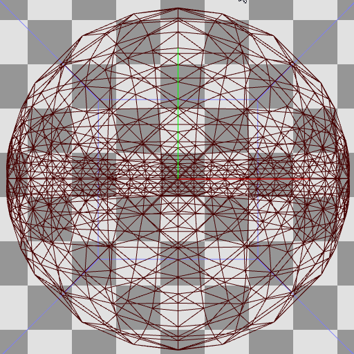
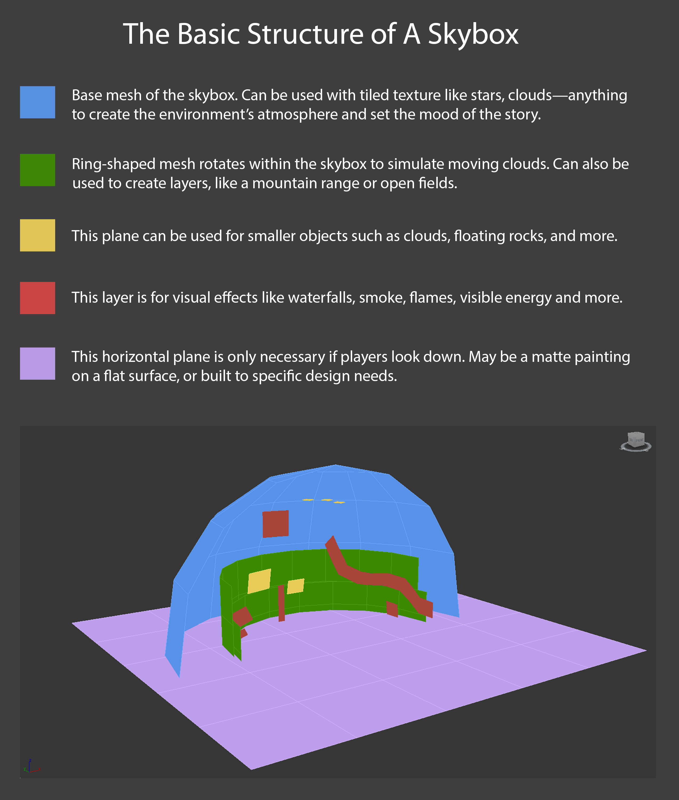
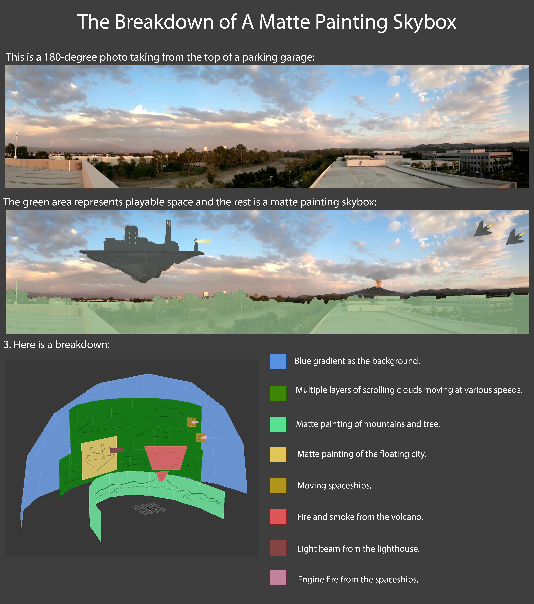

# Sky

## Skybox 메쉬 형태

- Cube, Sphere, HemiSphere, Ring, Plane

- 유니티 Shader별 사용 메쉬 형태

| Shader            | Mesh   | draw        |
| ----------------- | ------ | ----------- |
| Mobile/Skybox     | Cube   | Draw(6) * 6 |
| Skybox/6 Sided    | Cube   | Draw(6) * 6 |
| Skybox/Cubemap    | Sphere | Draw(5040)  |
| Skybox/Panoramic  | Sphere | Draw(5040)  |
| Skybox/Procedural | Sphere | Draw(5040)  |

- 렌더독으로 본 유니티의 Sphere Sky Mesh
  - 일반 Sphere 와는 다르게, 버텍스 갯수는 적게 그리고 수평선 부분이 조금 디테일에 힘을 줬다.

  

## 유니티 Skybox셰이더 작성시 주의점

- 유니티 Skybox 설정 : `Window > Rendering > Lighting > Environment`
  - `unity_SpecCube0`가 위에서 설정된 메테리얼로 스카이박스를 렌더링함.(`Camera > Background Type`과는 상관없음)
- URP 환경이라도 Built-in(legacy)의 기본 Pass의 태그값 `"LightMode" = "ForwardBase"`로 하여야만 동작한다.

## 유니티의 Skybox

- 유니티에서는 Skybox의 메쉬를 지정할 수 있는 방법이 없다.(2021.09.23 기준)
- 유니티 Skybox 설정을 안따르면 ReflectionProbe(unity_SpecCube0)를 다루기 껄끄러워진다.
  - `Window > Rendering > Lighting > Environment > Environment Reflections > Source > Custom` 으로 처리 가능.

## Skybox 메쉬 조합

- [How to Create Skies for 3D Games?](https://80.lv/articles/how-to-create-skies-for-3d-games/)

구름을 표현하기 위해 돔형태의 메쉬, 링형 매쉬, 평면 매쉬를 이용했다.





## Case Study

``` hlsl
half daytimeGradient            = max(0, L_Sun.y);                   // 낮시간 변화 // max(0, dot(-L, DIR_DOWN));
half skybox_MidTopGradient      = max(0, -V.y);                      // 하늘쪽 변화 // max(0, dot(-V, DIR_UP));
half skybox_HorizBottomGradient = pow(1 - skybox_MidTopGradient, 8); // 바닥 + 수평 변화


// 낮시간 하늘의 3단계 변화
// - 카메라가 스카이박스 안쪽에 있으니 `-V`를 시켜주고, 하늘(Up)쪽으로 변화를 넣는다.
// - 수평선은 역으로해서 역변화를 얻음.
half3 daytimeSkyMiddleColor       = lerp(_SkyColor_Sunset, _SkyColor_DaytimeMiddle, daytimeGradient);
half3 daytimeSkyMiddleBottomColor = lerp(daytimeSkyMiddleColor, _SkyColor_DaytimeBottom, skybox_HorizBottomGradient);
half3 daytimeSkyGradientColor     = lerp(daytimeSkyMiddleBottomColor, _SkyColor_DaytimeTop, skybox_MidTopGradient);


// 밤낮을 표현하기 위해 빛이 땅을 바라볼때 변화량([0, 1]) 이용.
half3 skyNightDayColor = lerp(_SkyColor_Night, daytimeSkyGradientColor, daytimeGradient);


// 빛이 바라보는 반대 방향에 해를 위치 시킨다.
half sunGradient = dot(-L_Sun, V);
half sun = pow(sunGradient, 20);


// 노을의 빛의 퍼짐을 표현하기 위해, 노을색과 붉기를 조절한 빛의 색을 섞는다.
half _SunsetRedness = 0.5; // [0, 1]
half invRedness = 1 - _SunsetRedness;
half3 redishLightColor;
redishLightColor.r = IN.colorLight.r;
redishLightColor.g = IN.colorLight.g * invRedness;
redishLightColor.b = IN.colorLight.b * invRedness * 0.5;
half3 sunsetColor = lerp(_SkyColor_Sunset, redishColor, sun);


// 해 위치를 빛 방향과 같게 조정하면
// 케릭터에 조명효과를 다르게 주고 싶어 불가피하게 빛 방향을 바꿔 버리면,
// 의도치 않도록 해 위치가 바뀌어 버릴 수 있다.
_ControlledDaytime // [0, 1]
#define TWO_PI            6.28318530717958647693  // com.unity.render-pipelines.core/ShaderLibrary/Macros.hlsl
#define SHORT_TWO_PI      6.2831853

half rad =  _ControlledDaytime * SHORT_TWO_PI;
half s;
half c;
sincos(rad, s, c);
OUT.L_Sun.x = -c;
OUT.L_Sun.y = s;
OUT.L_Sun.z = 0;

|                       | 0   | 90   | 180 | 270  | 360    |
| --------------------- | --- | ---- | --- | ---- | ------ |
| _ControlTime          | 0   | 0.25 | 0.5 | 0.75 | 1      |
| _ControlTime x TWO_PI | 0   |      | PI  |      | TWO_PI |
| x (-cos)              | -1  | 0    | 1   | 0    | -1     |
| y (sin)               | 0   | 1    | 0   | -1   | 0      |

```

## 기타 코드 조각들

``` hlsl
// ref: [mapping texture uvs to sphere for skybox](https://gamedev.stackexchange.com/questions/189357/mapping-texture-uvs-to-sphere-for-skybox)
// ref: [Correcting projection of 360° content onto a sphere - distortion at the poles](https://gamedev.stackexchange.com/questions/148167/correcting-projection-of-360-content-onto-a-sphere-distortion-at-the-poles/148178#148178)

uv.x = (PI + atan2(positionWS.x, positionWS.z)) * INV_TWO_PI;
uv.y = uv.y * 0.5 + 0.5
```

``` hlsl
// ref: [ARM - The Ice Cave demo](https://developer.arm.com/documentation/102259/0100/Procedural-skybox)

half3 _SunPosition;
half3 _SunColor;
half _SunDegree;    // [0.0, 1.0], corresponds to a sun of diameter of 5 degrees: cos(5 degrees) = 0.995

half4 SampleSun(in half3 viewDir, in half alpha)
{
    // 원형 해
    half sunContribution = dot(viewDir,_SunPosition);

    half sunDistanceFade = smoothstep(_SunDegree - (0.025 * alpha), 1.0, sunContribution);
    half sunOcclusionFade = clamp(0.9 - alpha, 0.0, 1.0);
    half3 sunColorResult = sunDistanceFade * sunOcclusionFade * _SunColor;
    return half4(sunColorResult, 1.0);
}
```

``` hlsl
// ['Infinite' sky shader for Unity](https://aras-p.info/blog/2019/02/01/Infinite-sky-shader-for-Unity/)
// 유니티는 "reversed-Z projection"을 이용하지만, "infinite projection"은 아니다

#if defined(UNITY_REVERSED_Z)
// when using reversed-Z, make the Z be just a tiny
// bit above 0.0
OUT.positionCS.z = 1.0e-9f;
#else
// when not using reversed-Z, make Z/W be just a tiny
// bit below 1.0
OUT.positionCS.z = o.positionCS.w - 1.0e-6f;
#endif
```

## TODO

- 구름 그림자
  - <https://github.com/EntroPi-Games/Unity-Cloud-Shadows/>

## Ref

- [Unity's built-in Skybox-Procedural.shader](https://github.com/TwoTailsGames/Unity-Built-in-Shaders/blob/master/DefaultResourcesExtra/Skybox-Procedural.shader)
- [마른 하늘에 날구름 넣기](https://www.slideshare.net/ajinkim/ss-58266584)
- [[TA] 테라에 사용된 렌더링 테크닉 - 임신형 (valhashi)](https://www.slideshare.net/valhashi/2011-03-gametechtadptforpdf)
- [Procedural Skybox - Evan edwards](https://www.e2gamedev.com/skybox)
- [EasySky: Breakdown of a Procedural Skybox for UE4](https://80.lv/articles/easysky-breakdown-of-a-procedural-skybox-for-ue4/)
- [GDC2014  - Moving the Heavens: An Artistic and Technical Look at the Skies of The Last of Us](https://www.youtube.com/watch?v=o66p1QDH7aI)
- [Reaching for the stars - Let’s create a procedural skybox shader with Unity’s Shader Graph!](https://medium.com/@jannik_boysen/procedural-skybox-shader-137f6b0cb77c)
- Unity ShaderGraph Procedural Skybox Tutorial
  - [cloud texture](https://timcoster.com/2019/09/09/tileable-clouds-texture/)
  - [pt1](https://timcoster.com/2019/09/03/unity-shadergraph-skybox-quick-tutorial/)
  - [pt2](https://timcoster.com/2020/02/26/unity-shadergraph-procedural-skybox-tutorial-pt-2-day-night-cycle/)
- Rastertek's Terrain Tutorial
  - Tutorial 10: Sky Domes : [원문](http://www.rastertek.com/tertut10.html), [번역](https://copynull.tistory.com/313)
  - Tutorial 11: Bitmap Clouds : [원문](http://www.rastertek.com/tertut11.html), [번역](https://copynull.tistory.com/314)
  - Tutorial 12: Perturbed Clouds : [원문](http://www.rastertek.com/tertut12.html), [번역](https://copynull.tistory.com/315)
- [Creating a unique animated sky shader for UT3/UDK](http://cr4zyb4st4rd.co.uk/SkyShader.html) - [Cr4zys_Cloud_Textures.rar](http://cr4zyb4st4rd.co.uk/SkyShader/Cr4zys_Cloud_Textures.rar)
- [Maya - Skydome Techniques](https://www.youtube.com/watch?v=YwzOMHXYFyw)
- Unity Assets
  - <https://assetstore.unity.com/packages/tools/particles-effects/tenkoku-dynamic-sky-34435>
  - <https://assetstore.unity.com/packages/2d/textures-materials/sky/procedural-sky-builtin-lwrp-urp-jupiter-159992>
  - <https://assetstore.unity.com/packages/tools/particles-effects/azure-sky-dynamic-skybox-36050>
- <https://simul.co/>
- <https://github.com/shadowlenz/Procedural.SkyBox>
- <https://github.com/SebLague/Clouds>
  - <https://www.youtube.com/watch?v=4QOcCGI6xOU>
- <https://guildofwriters.org/wiki/Adding_Atmosphere>
- [Volumetric Clouds – 体积云的做法](http://walkingfat.com/volumetric-clouds-%e4%bd%93%e7%a7%af%e4%ba%91%e7%9a%84%e5%81%9a%e6%b3%95/)
- 천체리소스 : <https://pngtree.com/so/celestial>
- ShaderX3 Advanced Rendering with DirectX and OpenGL
  - 8.4 Volumetric Clouds
- ShaderX2 Shader Programming Tips and Tricks with DirectX 9
  - Advanced Sky Dome Rendering
