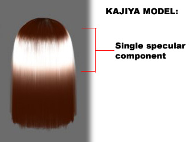
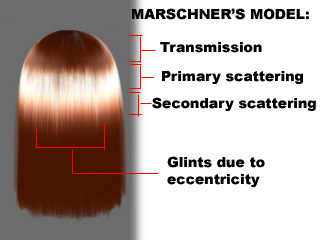

# Hair Anisotropic

``` txt
비등방성(非等方性)(anisotropy)은 방향에 따라 물체의 물리적 성질이 다른 것을 말한다. 
예를 들어, 솔질이 된 알루미늄, 섬유, 옷감, 근육 등의 표면은
들어오는 빛의 방향에 따라 반사율이 다른 광학적 비등방성을 띈다. 
- https://ko.wikipedia.org/wiki/비등방성
```

- Kajya-Kay 모델                            - SIGGRAPH 1989
  - 짧은머리는 괜춘. 빛의 산란효과는 별로
- Steve Marschner 모델                      - SIGGRAPH 2003
  - 빛의 산란효과 개선(반사/내부산란/투과)
- Scheuermann - Hair Rendering and Shading  - GDC 2004





- [【Unite Tokyo 2018】『崩壊3rd』開発者が語るアニメ風レンダリングの極意](https://youtu.be/ZpWsinhPFLM?t=1285)
- <https://graphics.pixar.com/library/DataDrivenHairScattering/>

## Kajiya-Kay

- SIGGRAPH 1989

- [blog - Hair Rendering Lighting Model - (Kajiya-Kay)](https://blog.naver.com/sorkelf/40185948507)


``` hlsl
// Sphere
// T | r | 오른쪽
// B | g | 위쪽
// N | b | 직각

// 논문에서 T. 방향은 머리를향한 위쪽 방향.
// half3 T = normalize(IN.T);

// Sphere에서는 B가 위쪽이므로 B로해야 원하는 방향이 나온다.
half3 T = normalize(IN.B);

half sinTH    = sqrt(1 - dot(T, H) * dot(T, H));
half specular = pow(sinTH, specularPower);
```

## Marschner

- SIGGRAPH 2003
- [blog - Hair Rendering Lighting Model - (Marschner)](https://blog.naver.com/sorkelf/40186644136)
- [pdf - Light Scattering from Human Hair Fibers - Stephen R. Marschner, Henrik Wann Jensen, Mike Cammarano](www.cs.cornell.edu/~srm/publications/SG03-hair.pdf)
- [2020 - Dev Weeks: A3 Still Alive - Technical Art Review](https://youtu.be/ufNYLgE2WGA?t=1952)


|     |      |
|-----|------|
| R   | 반사 |
| TRT | 산란 |
| TT  | 투과 |

- 2개의 반사를 이용.
  - Tangent를 이동 (+ TangentShiftTex)
  - 1번째 반사(RR)
  - 두번째반사(TRT) (+ SpecularMaskTex)

## Scheuermann

- GDC 2004 Hair Rendering and Shading
- Kajiya-Kay랑 Marschner를 믹스함

## 에니메이션

- [버텍스 셰이더로 하는 머리카락 애니메이션](https://www.slideshare.net/jalnaga/ss-61522038)

## Ref

- [Hair in Tomb Raider](https://www.slideshare.net/WolfgangEngel/hair-intombraider-final)
- ShaderX3 Advanced Rendering with DirectX and OpenGL
  - 2.14 Hair Rendering and Shading
