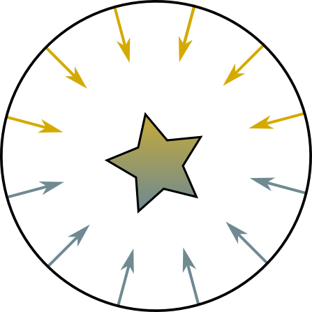

# HemisphereLight



``` txt
if (degree <= 90)
    x = 1 - (0.5 * sin(degree));
else
    x = 0.5 * sin(degree);

RealColor = x * TopColor + (1 - a) * BottomColor;
=================================================

// 비교적 편차가 적은 간소화 버전으로 변경가능.
x = 0.5 + (0.5 * cos(degree));
// - 분기가 없어졌다.
// - cos(degree)는 dot 연산으로 대처가능
// x = 0.5 + (0.5 * dot(N, L));

FakeColor = x * TopColor + (1 - a) * BottomColor;
```


``` hlsl
half hemiWeight = 0.5 + 0.5 * dot(N, L);
half3 diffuse = lerp(_GroundColor, _SkyColor, hemiWeight);

half3 camPositionWS = GetCurrentViewPosition();
half3 L_VS = GetWorldSpaceViewDir(L);
half skyWeight = 0.5f + 0.5 * max(0, dot(N, normalize(camPositionWS + L_VS)));
half groundWeight = 0.5f + 0.5 * max(0, dot(N, normalize(camPositionWS - L_VS)));
half3 specular = (max(0, pow(skyWeight, _SpecularPower)) + max(0, pow(skyWeight, _SpecularPower)))
    *_SpecularNormFactor
    * hemiWeight
    * diffuse;
half3 result = diffuse + specular;
```

## Ref

- <https://github.com/hughsk/glsl-hemisphere-light>
- <https://emunix.emich.edu/~mevett/GraphicsCourse/Labs/MattsLab5Lighting/index.html#Hemisphere>
- <https://en.wikibooks.org/wiki/GLSL_Programming/Unity/Diffuse_Reflection_of_Skylight>
- [Hemisphere Lights - Interactive 3D Graphics](https://www.youtube.com/watch?v=l7k32_BvkWA)
