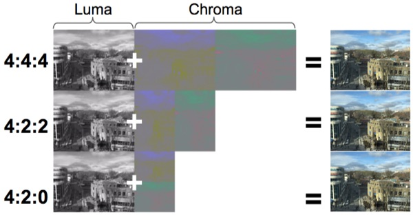
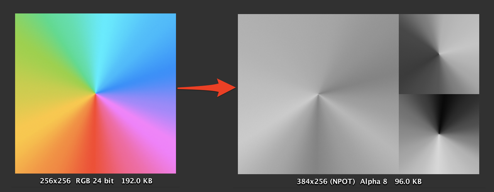

# ChromaSubsampling

| 사람 눈 세포 | 인식      | 갯수          |
| ------------ | --------- | ------------- |
| 간상세포     | 밝기 변화 | 9천만 개 이상 |
| 원추세포     | 색상      | 600만 개정도  |

- 사람의 시각은 밝기의 변화에 비하여 색상의 변화에는 둔감.

- <https://en.wikipedia.org/wiki/Chroma_subsampling>

| 예    | 텍스쳐 /사이즈   | 표현 픽셀당 필요 비트 수 | 비트 비율 |
| ----- | ---------------- | ------------------------ | --------- |
| 원본  | ARGB32 / 256x256 | 32bit * 1 == 32          | 1         |
| 4:2:2 | Alpha8 / 512x256 | 8bit * 2 == 16           | 0.5       |
| 4:2:0 | Alpha8 / 384x256 | 8bit * 1.5 == 12         | 0.375     |

- 원본이미지를 Y'CbCr로 바뀌어 하나의 채널만을 이용하여 저장. (이미지 사이즈가 늘어나기에 POT이미지인 경우 NPOT로 바뀌게 됨)
- 메모리를 아껴주긴하니, 모션블러나같이 RenderTexture사용시 메모리 아낄때 이용하면 좋을듯.

## ChromaPack

- <https://github.com/keijiro/ChromaPack>
  - 4:2:0 Y'CbCr를 이용한다.
  - 알파있는 것은 Y'의 8비트중 1비트를 이용하여 처리
  - 변형하여 YCgCo를 이용한 버전 : <https://github.com/n-yoda/unity-ycca-subsampling>
  - 이미지 압축시 품질 손실을 막기위해 고안
    - 예로 유니티 내장 PVRTC 변환툴로 변환하면 텍스쳐 압축시 품질저하가 일어남(일러스트같은경우 문제가됨)
    - 품질저하를 줄인 상용 이미지 편집기가 있기도 함(OPTPiX iMageStudio)
    - ASTC가 나온이상, 이게 필요할까? 라는 의문점이 있음

## Ref

- <https://blog.uwa4d.com/archives/TechSharing_186.html>
- <https://techblog.kayac.com/texture-compression-in-yuv>
  - <https://github.com/hiryma/UnitySamples/tree/master/Yuv>
- [2020 - Dev Weeks: 성능 프로파일링과 최적화](https://www.youtube.com/watch?v=4kVffWfmJ60&t=4870s)
