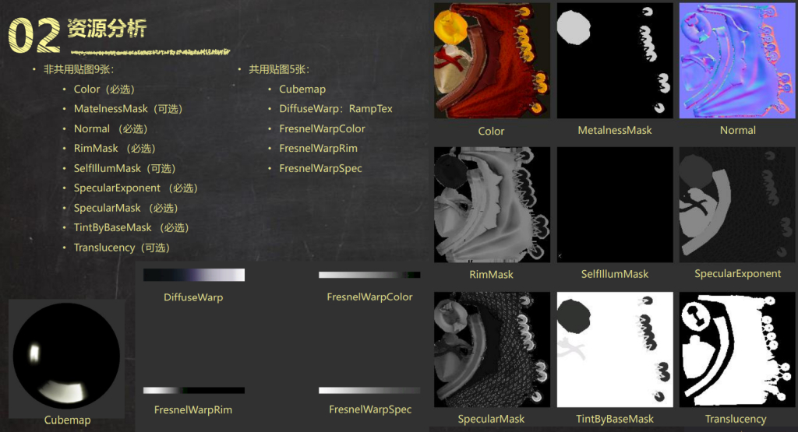

# Optimize Combine Texture

- 여러장의 텍스쳐를 쓰는 대신, 안쓰는 채널이 없도록 packing한다면, 추가적인 텍스쳐를 불러오는 로딩시간과 메모리를 줄일 수 있다.

- 예)
  - Albedo + Specular
  - NormalMap + HeightMap
  - ...

- [EasyChannelPacking](https://gumroad.com/l/EasyChannelPacking)

|               |     |                |
| ------------- | --- | -------------- |
| _DiffuseTex   | RGB | 불투명시 3채널 |
| _NormalTex    | RG  |                |
| _SpecularTex  | R   |                |
| _MaskTex      | R   |                |
| _HeightMapTex | R   |                |
| _NoiseTex     | R   |                |
| _BrdfTex      |     |                |
| ...           | R   |                |

## ex) [NormalMap](../NormalMap.md)와 [ParallaxMapping](../ParallaxMapping.md)

- NormalMap에선 R,G채널 2개의 채널을
- ParallaxMapping에선 깊이에 대한 하나의 채널을 추가해서 사용한다

## NormaMap Packing시 주의

BC5 (x, y, 0, 1)을 보면, `RGBA`채널중에서 `RG`채널만 사용하고 있다. 이를 이용하여, `BA`채널에 마스킹이나 다른 데이터값을 체워 넣을 수 있다.

`B`채널은 공짜로 사용할 수 있으나, `A`채널까지 사용하려면  유니티의 `UnpackNormal`함수는 다음과 같이 채널을 바꾸는 기능이 있어, 따로 함수를 작성해 주어야 한다.

``` hlsl
// Unpack normal as DXT5nm (1, y, 0, x) or BC5 (x, y, 0, 1)
real3 UnpackNormalmapRGorAG(real4 packedNormal, real scale = 1.0)
{
    // Convert to (?, y, 0, x)
    // R과 A를 혼합하는 과정이 있는데, 이미 텍스쳐의 포맷을 알고 있으면 이 과정은 불필요하다.
    packedNormal.a *= packedNormal.r;
    return UnpackNormalAG(packedNormal, scale);
}
```

## ex




