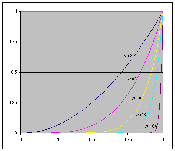

# Specular Pow Approximation

## 제곱하는 횟수 n을 줄여보자면(m만큼)?

Specular 구할때 보통 pow쓰는데 이때 제곱되어 지는 횟수를 줄여봐보자



이 그래프에서 예를들어 n=4와 n=16을 비교할때, n=4의 그래프의 기울기와 시작 위치를 얼추 조절하면 오차야 있겠지만, n=16그래프와 비슷해 질 것이다.


그럼 기울기와 오프셋을 구하는 것은 위 문서에 나와있다.

이걸 활용해보자.


예를들어, pow(x, 18)을 구하고자 한다면,

``` txt
x^n 
max(0, Ax + B)^m // 단,  x < pow(256, -1/n )은 0으로 취급
```

테이블에서 다음 라인을 확인 할 수 있을 것이다.

| m | n  | A     | B      | Max error |
|---|----|-------|--------|-----------|
| 2 | 18 | 6.645 | -5.645 | 0.063146  |

공식에 대입하면 다음과 같은 식을 얻을 수 있다.

``` hlsl
inline half n18Approximation(half x)
{
    // n | 18
    // m | 2
    //     pow(x, n)
    //     pow(x, 18)
    //     pow(max(0, Ax        + B     ), m)
    return pow(max(0, 6.645 * x + -5.645), 2);
}
```

``` hlsl
half3 specularColor = pow(max(0, dot(R, V)), 18);

half3 specularColor = n18Approximation(max(0, dot(R, V)));
```

## Ref

- [A Non-Integer Power Function on the Pixel Shader - by Juan Guardado, Phillippe Beaudoin](https://www.gamasutra.com/view/feature/131381/a_noninteger_power_function_on_.php?page=2)
- [Fast Specular 계산](https://gamedevforever.com/36)
