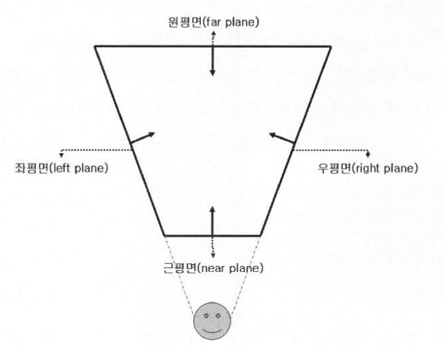
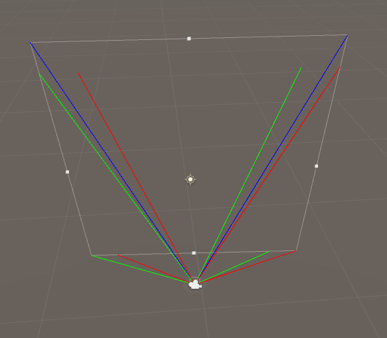
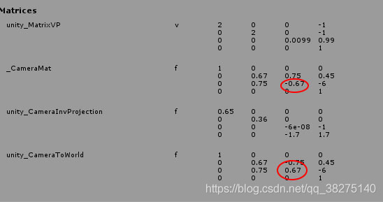
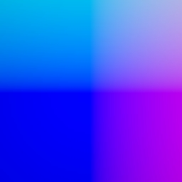

# LightShaft_Postprocess

- Shaft : 한 줄기 광선, 전광
- [wiki](https://en.wikipedia.org/wiki/Sunbeam#Crepuscular_rays) : aka. Sun beam / Sun Shafts/ Crepuscular Ray / God Ray

## Frustum

- Frustum : 절두체





- [Camera.stereoActiveEye](https://docs.unity3d.com/ScriptReference/Camera-stereoActiveEye.html)
  - Camera.MonoOrStereoscopicEye.Mono : 파랑
  - Camera.MonoOrStereoscopicEye.Left : 초록
  - Camera.MonoOrStereoscopicEye.Right : 빨강

``` cs
_materia_LightShaft.SetVector("_CameraPositionWS", camera.transform.position);
_materia_LightShaft.SetMatrix("_Matrix_CameraFrustum", FrustumCorners(camera));


private Matrix4x4 FrustumCorners(Camera cam)
{
  // ref: http://hventura.com/unity-post-process-v2-raymarching.html

    Transform camtr = cam.transform;

    // frustumCorners
    //    1  +----+ 2
    //       |    |
    //    0  +----+ 3
    Vector3[] frustumCorners = new Vector3[4];
    cam.CalculateFrustumCorners(
        new Rect(0, 0, 1, 1),  // viewport
        cam.farClipPlane,      // z
        cam.stereoActiveEye,   // eye
        frustumCorners         // outCorners
    );

    // frustumVectorsArray
    //    3  +----+ 2
    //       |    |
    //    0  +----+ 1
    Matrix4x4 frustumVectorsArray = Matrix4x4.identity;
    frustumVectorsArray.SetRow(0, camtr.TransformVector(frustumCorners[0]));
    frustumVectorsArray.SetRow(1, camtr.TransformVector(frustumCorners[3]));
    frustumVectorsArray.SetRow(2, camtr.TransformVector(frustumCorners[1]));
    frustumVectorsArray.SetRow(3, camtr.TransformVector(frustumCorners[2]));

    // in Shader
    // IN.uv
    // (0,1) +----+ (1,1)
    //       |    |
    // (0,0) +----+ (1,0)
    //
    // int frustumIndex = (int)(IN.uv.x +  2 * IN.uv.y);
    //    2  +----+ 3
    //       |    |
    //    0  +----+ 1
    return frustumVectorsArray;
}

```

``` hlsl
struct Ray
{
    float3 origin;
    float3 direction;
    float3 energy;
};

Ray CreateRay(in float3 origin, in float3 direction)
{
    Ray ray;
    ray.origin = origin;
    ray.direction = direction;
    ray.energy = float3(1, 1, 1);
    return ray;
}

Ray CreateCameraRay(in float2 uv)
{
    // 원점이 화면 중앙이 되도록 uv [0, 1]을 [-1, 1]로 변경.
    float2 screenUV = uv * 2.0f - 1.0f;

    // -1이 있는 이유는 unity_CameraToWorld의 구성요소가 camera.cameraToWorldMatrix와는 다르기 때문이다.
    float4x4 negativeMat = float4x4(
        1,  0,  0,  0,
        0,  1,  0,  0,
        0,  0, -1,  0,
        0,  0,  0,  1
    );
    float4x4 cameraToWorldMatrix = mul(unity_CameraToWorld, negativeMat);

    // 카메라 공간 (0, 0, 0)으로 cameraPositionWS 좌표를 얻어와서
    float3 cameraPositionWS = mul(cameraToWorldMatrix, float4(0.0f, 0.0f, 0.0f, 1.0f)).xyz;
    
    // 프로젝션 (curr.x, curr.y, 1)에서 currPositionWS를 얻어와서 ray의 방향을 구한다.
    float3 currPositionCamera = mul(unity_CameraInvProjection, float4(screenUV, 1.0f, 1.0f)).xyz;
    float3 currPositionWS = mul(cameraToWorldMatrix, float4(currPositionCamera, 0.0f)).xyz;
    float3 rayDirection = normalize(currPositionWS);

    return CreateRay(cameraPositionWS, rayDirection);
}
```

``` hlsl
float4x4 _Matrix_CameraFrustum;

// IN.uv
// (0,1) +----+ (1,1)
//       |    |
// (0,0) +----+ (1,0)

// frustumIndex
//    2  +----+ 3
//       |    |
//    0  +----+ 1
int   frustumIndex          = (int)(IN.uv.x +  2 * IN.uv.y);
half3 frustumPositionCamera = _Matrix_CameraFrustum[frustumIndex].xyz;
```



## frustumPositionWS와 normalize(frustumPositionWS)




## 예

``` hlsl
// 1. shadow맵과 depth 맵을 이용하여 마스크 맵을 만든다
#include "Packages/com.unity.render-pipelines.universal/ShaderLibrary/Shadows.hlsl"
#include "Packages/com.unity.render-pipelines.universal/ShaderLibrary/DeclareDepthTexture.hlsl"

// 카메라의 Frustum의 각 꼭지점을 구하고, normalize하여 해당 방향으로 ray를 쏜다

half stepDistance = _MinDistance + (step * Random(rayDirWS.xy, _Time.y * 100));

// 2. 합한다
color = lerp(mainTex, _MainLightColor.rgb, lightShaftMask);
```

## 관련자료

- Shadow Volume Algorithm (Modified) [ MAX 1986 ]
- Slice-based volume-rendering technique [ Dobashi & Nishta & Yamamoto 2002 ]
- Hardware Shadow Map [ Mitchell 2004 ]
- Polygonal Volume [ James 2003 Based On Radomir Mech 2001]
- Volumetric Light Scattering [ Hoffman & Preetham 2003 ]

## Ref

- [GDC2008 - Crysis Next-Gen Effects](https://www.slideshare.net/TiagoAlexSousa/crysis-nextgen-effects-gdc-2008)
- <https://developer.nvidia.com/gpugems/gpugems3/part-ii-light-and-shadows/chapter-13-volumetric-light-scattering-post-process>
  - <https://zhuanlan.zhihu.com/p/405975067>
  - <https://blog.csdn.net/qq_38275140/article/details/91049023>
  - <https://github.com/togucchi/urp-postprocessing-examples/tree/main/Assets/LightShaft>
- <https://blog.naver.com/sorkelf/40152690614>
- <https://blog.naver.com/eryners/110127353463>
- <http://maverickproj.web.fc2.com/pg65.html>
- ShaderX3 Advanced Rendering with DirectX and OpenGL
  - 8.1 Light Shaft Rendering
