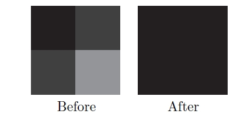

# SSR

- SSR(Screen Space Reflection)

## 주의점

- 화면 공간이므로, 당연히 화면밖이나 가려져 있는 것을 반사시키진 못한다
  - 화면 바깥과 가까우면 fadeout
  - 어느정도 구께일때만 반사적용
- 깊이버퍼를 이용함으로, 깊이버퍼를 안쓰는 오브젝트는 반사가 안됨
- 3d ray marching 언더샘플링 오버샘플링
- 모션블러 감소

## TODO

- SSR 준비물
  - 색상
  - 깊이(위치를 얻기 위해)
  - 노말
  - 반사 마스크

| 구할것              | 구하는 법                                                                      |
| ------------------- | ------------------------------------------------------------------------------ |
| 카메라레이          | uv와 카메라 역행렬을 이용                                                      |
| 반사레이 시작점(VS) | 카메라 레이와 뎁스버퍼를 이용                                                  |
| 입사벡터(VS)        | 반사레이 시작점을 노말라이즈함. (incident : 입사/투사되는)                     |
| 반사레이벡터(VS)    | 입사벡터와 노멀을 이용                                                         |
| 반사레이 도착점(VS) | 반사레이벡터에서 점진적 이동(Ray Marching)                                     |
| 반사색              | 반사레이 도착점의 색 (두께처리가 있으면 처리하고, uv가 범위안에 있는지도 체크) |

## 반사 레이를 쏘는 방식

- <http://casual-effects.blogspot.com/2014/08/screen-space-ray-tracing.html>

|     |                                                          |
| --- | -------------------------------------------------------- |
| 3D  | 원근법때문에 언더샘플링(가까운거), 오버샘플링(먼것) 이슈 |
| 2D  | DDA(Digital Differential Analyzer)                       |

## 코드 예

``` cs
_material_SSR.SetMatrix( "_MATRIX_InverseCameraProjection", _camera.projectionMatrix.inverse);
```

``` hlsl
// vert =====================
// 카메라레이
float4 cameraRay = float4(IN.uv * 2 - 1, 1, 1);
cameraRay = mul(_MATRIX_InverseCameraProjection, cameraRay);
OUT.cameraRay = cameraRay.xyz / cameraRay.w;


// frag =====================
half reflectMask = SAMPLE_TEXTURE2D(_ReflectMask_, sampler_ReflectMask, IN.uv).r;
clip(reflectMask - 0.1);

// 반사레이 시작점
half sceneRawDepth = SampleSceneDepth(IN.uv);
half scene01Depth  = Linear01Depth(sceneRawDepth, _ZBufferParams);
half3 reflectRayStartPositionWS = IN.cameraRay * sceen01Depth;

// 입사벡터
half3 incidentVec = normalize(reflectRayStartPositionWS);

// 반사레이벡터
half3 sceneNormal = SampleSceneNormals(IN.uv);
half3 reflectRayDirWS = normalize(reflect(incidentVec, sceneNormal));

// 레이 처리
half step = _MaxDistance / _MaxIteration;
half stepDistance = _MinDistance + step;
half availableThickness = _MaxThickness / _MaxIteration;
int iteratorCount = min(64, _MaxIteration);
half3 reflectionColor = 0;

UNITY_UNROLL
for (int i = 0; i < iteratorCount; ++i)
{
    // 반사레이 도착점 
    half3 reflectRayEndPositionWS = reflectRayStartPositionWS + (reflectRayDirWS * stepDistance);
    float4 reflectRayEndPositionCS = TransformWorldToHClip(reflectRayEndPositionWS);
    float2 reflectRayEndUV = reflectRayEndPositionCS.xy / reflectRayEndPositionCS.w * 0.5 + 0.5;

    bool isValidUV = max(abs(reflectRayEndUV.x - 0.5), abs(reflectRayEndUV.y - 0.5)) <= 0.5;
    if (!isValidUV)
    {
        break;
    }

    half reflectRayEndDepth = ComputeDepth(reflectRayEndPositionCS);
    half sceneReflectRayEndDepth = SampleSceneDepth(reflectRayEndUV);
    half depthDiff = reflectRayEndDepth - sceneReflectRayEndDepth;
    if (0 < depthDiff && depthDiff < availableThickness)
    {
        // 반사색
        reflectionColor = SAMPLE_TEXTURE2D(_MainTex, sampler_MainTex, reflectRayEndUV).rgb;
        break;
    }

    stepDistance += step;
}
return half4(reflectionColor, 1);


// etc ==========================
float ComputeDepth(float4 positionCS)
{
#if defined(SHADER_TARGET_GLSL) || defined(SHADER_API_GLES) || defined(SHADER_API_GLES3)
    return (positionCS.z / positionCS.w) * 0.5 + 0.5;
#else
    return (positionCS.z / positionCS.w);
#endif
}
```

```
???
    float sampleDepth = tex_depth.read(tid).x;
    float4 samplePosInCS =  float4(((float2(tid)+0.5)/sceneInfo.ViewSize)*2-1.0f, sampleDepth, 1);
    samplePosInCS.y *= -1;
```


incidentVec = normalize(rayStartPositionWS)
N

half3 reflectionColor = 0;
if (reflectMask > 0)
{
  reflectionColor = 
}


half3 scaledR = _RayStepScale * R;
for (_MaxRayStep)
{

}

## Hi-Z Buffer

- Hierarchical-Z buffer
- 기존 Z buffer를 축소시키며 계층을 만들며(밉맵)
  - 셀은 최소 3×3 셀
- 기존 Z Buffer보다 비교적 적은 샘플 횟수로 교차점을 얻을 수 있다.



- https://zhuanlan.zhihu.com/p/278793984

## Ref

- <https://www.slideshare.net/xtozero/screen-space-reflection>
- <http://www.kode80.com/blog/2015/03/11/screen-space-reflections-in-unity-5/>
  - <https://github.com/kode80/kode80SSR>
- Screen Space Reflections : Implementation and optimization
  - [src](https://github.com/leesg213/ssr_optimizing), [pt1](https://sugulee.wordpress.com/2021/01/16/performance-optimizations-for-screen-space-reflections-technique-part-1-linear-tracing-method/), [pt2](https://sugulee.wordpress.com/2021/01/19/screen-space-reflections-implementation-and-optimization-part-2-hi-z-tracing-method/)
  - [번역1](https://scahp.tistory.com/66), [번역2](https://scahp.tistory.com/67)
- GPU Pro 5: Hi-Z Screen-Space Cone-Traced Reflections by Yasin Uludag
- <https://github.com/Unity-Technologies/Graphics/blob/master/com.unity.postprocessing/PostProcessing/Shaders/Builtins/ScreenSpaceReflections.hlsl>
- [Unity で Screen Space Reflection の実装をしてみた](https://tips.hecomi.com/entry/2016/04/04/022550)
  - <https://github.com/hecomi/UnityScreenSpaceReflection>
- [GDC2016 - Low Complexity, High Fidelity: The Rendering of INSIDE](https://youtu.be/RdN06E6Xn9E?t=2243)
- [GDC2016 - Temporal Reprojection Anti-Aliasing in INSIDE](https://www.youtube.com/watch?v=2XXS5UyNjjU)
  - <https://github.com/playdeadgames/temporal>
- [GPU Pro 6: Advanced Rendering Techniques - II: RENDERING - 1.2.3 Screen-Space Reflections](https://books.google.co.kr/books?id=30ZOCgAAQBAJ&pg=PA65&lpg=PA65#v=onepage&q&f=false)
- Approximating ray traced reflections using screen-space data by MATTIAS JOHNSSON
- <https://dataprocess.tistory.com/315>
- <https://sakibsaikia.github.io/graphics/2016/12/26/Screen-Space-Reflection-in-Killing-Floor-2.html>
- <http://roar11.com/2015/07/screen-space-glossy-reflections/>
- [Screen Space Reflections in The Surge](https://www.slideshare.net/MicheleGiacalone1/screen-space-reflections-in-the-surge)
- [SIGGRAPH2015 -  Stochastic Screen-Space Reflections](https://www.slideshare.net/DICEStudio/stochastic-screenspace-reflections)
- <https://lettier.github.io/3d-game-shaders-for-beginners/screen-space-reflection.html>
- <https://www.gamedeveloper.com/disciplines/screen-space-reflections-in-blightbound>
