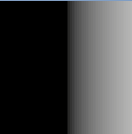
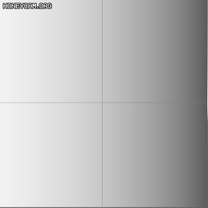
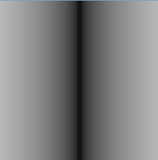
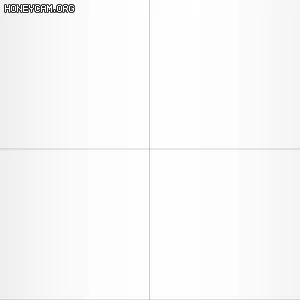
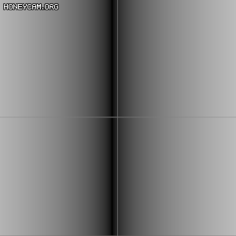
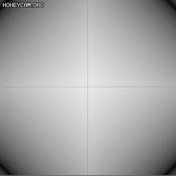

// - https://lexdev.net/tutorials/case_studies/overwatch_shield.html
// - https://github.com/LexdevTutorials/OverwatchShield

[Intersection Material using Shader Graph in Unity](https://www.youtube.com/watch?v=ayd8L6ZyCvw)
[FORCE FIELD in Unity - SHADER GRAPH](https://www.youtube.com/watch?v=NiOGWZXBg4Y)

https://www.taodudu.cc/news/show-2015342.html
https://zhuanlan.zhihu.com/p/328955585

``` hlsl
half3 combinedTex = SAMPLE_TEXTURE2D(_CombinedTex, sampler_CombinedTex, IN.uv).rgb;

half horizontalDist = abs(IN.positionOS.x);
half verticalDist = abs(IN.positionOS.z);

// Pulse
half4 pulseColor = combinedTex.g;
half4 pulseTerm = pulseColor * _BaseColor * _PulseIntensity;
pulseTerm *= abs(
    sin(_Time.y * _PulseTimeScale               // 시간 빠르기.
        - horizontalDist * _PulsePosScale       // 좌우 이동.
        + pulseColor * _PulseTexOffsetScale     // PulseColor에 대한 가중치.
    )
);

// HexEdge
half hexEdge = combinedTex.r;
half4 hexEdgeTerm = hexEdge * _HexEdgeColor * _HexEdgeIntensity;
hexEdgeTerm *= max(
    sin((horizontalDist + verticalDist) * _HexEdgePosScale
        - _Time.y * _HexEdgeTimeScale)
    - _HexEdgeWidthModifier
    ,
    0.0f
);
hexEdgeTerm *= (1 / (1 - _HexEdgeWidthModifier));

// Edge
half edgeTex = combinedTex.b;
half3 edgeTerm = pow(edgeTex, _EdgeExponent) * _EdgeColor.rgb * _EdgeIntensity;

// InterSection
half2 screenUV = IN.positionNDC.xy / IN.positionNDC.w;
half depth = Linear01Depth(SampleSceneDepth(screenUV), _ZBufferParams) * _ProjectionParams.z - IN.positionNDC.w;
half intersectGradient = 1 - min(depth, 1.0f);
half3 intersectTerm = _EdgeColor.rgb * pow(intersectGradient, _IntersectExponent) * _IntersectIntensity;

```

sin(positionOS.x)
    

- sin값이 적어질 수록 어두워진다.
- 이걸 이용해서 time을 빼주면 우측에서 좌측으로 이동하는 효과를 얻을 수 있다.

sin(positionOS.x - time)
    

- 선모양을 만들기 위해 abs를 씌워주면, 다음 과 같은 모양을 얻을 수 있고.

abs(sin(positionOS.x))
    

- 여기에서 시간을 이용해서 우에서 좌로,

abs(sin(positionOS.x + time))
    

- 여기에서 시간을 이용해서 좌에서 우로 움직일 수 있다.

abs(sin(positionOS.x - time))
    

- y값과 조합해서 사용하면 다음과 같이 다이야몬드 효과 역시 얻을 수 있다.

abs(sin(abs(positionOS.x) + abs(positionOS.y) - time))
    

## Depth

- 참고
  - https://www.cyanilux.com/tutorials/depth/
  - https://programming.vip/docs/5d0a938facf66.html


## TODO
https://www.ronja-tutorials.com/post/017-postprocessing-depth/