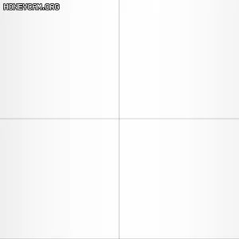

// - https://lexdev.net/tutorials/case_studies/overwatch_shield.html
// - https://github.com/LexdevTutorials/OverwatchShield

[Intersection Material using Shader Graph in Unity](https://www.youtube.com/watch?v=ayd8L6ZyCvw)
[FORCE FIELD in Unity - SHADER GRAPH](https://www.youtube.com/watch?v=NiOGWZXBg4Y)


``` hlsl
half3 combinedTex = SAMPLE_TEXTURE2D(_CombinedTex, sampler_CombinedTex, IN.uv).rgb;

half horizontalDist = abs(IN.positionOS.x);
half verticalDist = abs(IN.positionOS.z);

// Pulse
half4 pulseColor = combinedTex.g;
half4 pulseTerm = pulseColor * _BaseColor * _PulseIntensity;
pulseTerm *= abs(
    sin(_Time.y * _PulseTimeScale               // 시간 빠르기.
        - horizontalDist * _PulsePosScale       // 좌우 이동.
        + pulseColor * _PulseTexOffsetScale     // PulseColor에 대한 가중치.
    )
);

// HexEdge
half hexEdge = combinedTex.r;
half4 hexEdgeTerm = hexEdge * _HexEdgeColor * _HexEdgeIntensity;
hexEdgeTerm *= max(
    sin((horizontalDist + verticalDist) * _HexEdgePosScale
        - _Time.y * _HexEdgeTimeScale)
    - _HexEdgeWidthModifier
    ,
    0.0f
);
hexEdgeTerm *= (1 / (1 - _HexEdgeWidthModifier));

// Edge
half edgeTex = combinedTex.b;
half3 edgeTerm = pow(edgeTex, _EdgeExponent) * _EdgeColor.rgb * _EdgeIntensity;

// InterSection
half2 screenUV = IN.positionNDC.xy / IN.positionNDC.w;
half depth = Linear01Depth(SampleSceneDepth(screenUV), _ZBufferParams) * _ProjectionParams.z - IN.positionNDC.w;
half intersectGradient = 1 - min(depth, 1.0f);
half3 intersectTerm = _EdgeColor.rgb * pow(intersectGradient, _IntersectExponent) * _IntersectIntensity;

```

sin(positionOS.x)
    

- sin값이 적어질 수록 어두워진다.
- 이걸 이용해서 time을 빼주면 우측에서 좌측으로 이동하는 효과를 얻을 수 있다.

sin(positionOS.x - time)
    

- 선모양을 만들기 위해 abs를 씌워주면, 다음 과 같은 모양을 얻을 수 있고.

abs(sin(positionOS.x))
    

- 여기에서 시간을 이용해서 우에서 좌로,

abs(sin(positionOS.x + time))
    

- 여기에서 시간을 이용해서 좌에서 우로 움직일 수 있다.

abs(sin(positionOS.x - time))
    

- y값과 조합해서 사용하면 다음과 같이 다이야몬드 효과 역시 얻을 수 있다.

abs(sin(abs(positionOS.x) + abs(positionOS.y) - time))
    

## Depth

- 참고
  - https://www.cyanilux.com/tutorials/depth/
  - https://programming.vip/docs/5d0a938facf66.html


``` hlsl
// com.unity.render-pipelines.universal/ShaderLibrary/ShaderVariablesFunctions.hlsl
VertexPositionInputs GetVertexPositionInputs(float3 positionOS)
{
    VertexPositionInputs input;
    input.positionWS = TransformObjectToWorld(positionOS);
    input.positionVS = TransformWorldToView(input.positionWS);
    input.positionCS = TransformWorldToHClip(input.positionWS);

    float4 ndc = input.positionCS * 0.5f;
    input.positionNDC.xy = float2(ndc.x, ndc.y * _ProjectionParams.x) + ndc.w;
    input.positionNDC.zw = input.positionCS.zw;

    return input;
}
```

NDC : Normalized Device Coordinates

[positionNDC](https://github.com/Unity-Technologies/Graphics/blob/master/com.unity.render-pipelines.universal/ShaderLibrary/ShaderVariablesFunctions.deprecated.hlsl)


[SampleSceneDepth](https://github.com/Unity-Technologies/Graphics/blob/master/com.unity.render-pipelines.universal/ShaderLibrary/DeclareDepthTexture.hlsl)

``` hlsl
// com.unity.render-pipelines.universal/ShaderLibrary/DeclareDepthTexture.hlsl

float SampleSceneDepth(float2 uv)
{
    return SAMPLE_TEXTURE2D_X(_CameraDepthTexture, sampler_CameraDepthTexture, UnityStereoTransformScreenSpaceTex(uv)).r;
}
```

[_ZBufferParams](https://docs.unity3d.com/Manual/SL-UnityShaderVariables.html)
Used to linearize Z buffer values. x is (1-far/near), y is (far/near), z is (x/far) and w is (y/far).
|   |              |
|---|--------------|
| x | 1 - far/near |
| y | far / near   |
| z | x / far      |
| w | y / far      |


[Linear01Depth / LinearEyeDepth](https://github.com/Unity-Technologies/Graphics/blob/master/com.unity.render-pipelines.core/ShaderLibrary/Common.hlsl)

``` hlsl
// com.unity.render-pipelines.core/ShaderLibrary/Common.hlsl

// Z buffer to linear 0..1 depth (0 at camera position, 1 at far plane).
// Does NOT work with orthographic projections.
// Does NOT correctly handle oblique view frustums.
// zBufferParam = { (f-n)/n, 1, (f-n)/n*f, 1/f }
float Linear01Depth(float depth, float4 zBufferParam)
{
    return 1.0 / (zBufferParam.x * depth + zBufferParam.y);
}

// Z buffer to linear depth.
// Does NOT correctly handle oblique view frustums.
// Does NOT work with orthographic projection.
// zBufferParam = { (f-n)/n, 1, (f-n)/n*f, 1/f }
float LinearEyeDepth(float depth, float4 zBufferParam)
{
    return 1.0 / (zBufferParam.z * depth + zBufferParam.w);
}
```

[_ProjectionParams](https://docs.unity3d.com/Manual/SL-UnityShaderVariables.html)

|   |                                         |
|---|-----------------------------------------|
| x | 1.0 (or –1.0 flipped projection matrix) |
| y | near plane                              |
| z | far plane                               |
| w | 1/FarPlane                              |


``` hlsl
// vert
VertexPositionInputs vertexInputs = GetVertexPositionInputs(IN.positionOS.xyz);
OUT.positionNDC = vertexInputs.positionNDC;

// frag
half2 screenUV = IN.positionNDC.xy / IN.positionNDC.w;
half sceneRawDepth = SampleSceneDepth(screenUV);
half scene01Depth = Linear01Depth(sceneRawDepth, _ZBufferParams);

// _ProjectionParams.z : (1 - far/near) / far 
half depth = scene01Depth * _ProjectionParams.z - IN.positionNDC.w;
half intersectGradient = 1 - min(depth, 1.0f);
```


``` hlsl
// vert
VertexPositionInputs vertexInputs = GetVertexPositionInputs(IN.positionOS.xyz);
OUT.positionWS = vertexInputs.positionWS;
OUT.positionNDC = vertexInputs.positionNDC;

// frag
half2 screenUV = IN.positionNDC.xy / IN.positionNDC.w;
half sceneRawDepth = SampleSceneDepth(screenUV);
half sceneEyeDepth = LinearEyeDepth(sceneRawDepth, _ZBufferParams);
half fragmentEyeDepth = -TransformWorldToView(IN.positionWS).z;
half depth = sceneEyeDepth - fragmentEyeDepth;
half intersectGradient = 1 - min(depth, 1.0f);
```


## TODO
https://www.ronja-tutorials.com/post/017-postprocessing-depth/