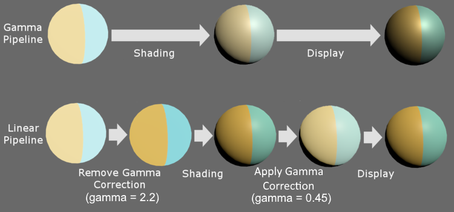

# Linear / Gamma

Unity에는 Gamma와 Linear를 선택할 수 있는 Color Space항목이 있다.

`Edit> Project Settings> Player> Other Settings> Rendering> Color Space`


## Gamma / Linear Color Space 차이

- [unity: Linear or gamma workflow](https://docs.unity3d.com/2021.1/Documentation/Manual/LinearRendering-LinearOrGammaWorkflow.html)

일단 결과물부터 확인해보자.


이러한 조명 강도, 블렌딩 차이는 어디서 오는 것일까?

## Gamma와 Linear

같은 RGB값이라도 Linear와 Gamma에서 보여지는 색이 다르다.


- 감마 보정([wiki: Gamma correction](https://en.wikipedia.org/w/index.php?title=Gamma_correction))

가운데 45도 선이 Linear(Gamma: 1.0)이며, 나머지는 감마 보정이다(위로는 Encode, 아레로는 Decode)


| Gamma correction | Gamma value  | 공간        |
|------------------|--------------|-------------|
| encode           | 0.45 (1/2.2) | sRGB        |
| -                | 1.0          | Linear      |
| decode           | 2.2          | Gamma / CRT |

- [wiki: sRGB](https://en.wikipedia.org/wiki/SRGB) : standard RGB color space.

## Gamma / Linear Color Space 환경



### 감마 보정 환경

| 환경   | Gamma correction | 설명                                        |
|--------|------------------|---------------------------------------------|
| 작업   | decode -> encode | 포토샵 기본셋팅: 편집(decode), 저장(encode) |
| 셰이더 | -                | 셰이더 계산은 Linear 환경이다.              |

### Rendering - Gamma Color Space

| 환경           | 공간      | 설명                       |
|----------------|-----------|----------------------------|
| 저장           | sRGB      | 하드디스크                 |
| 셰이더         | Linear    | sRGB 상태 텍스쳐           |
| 출력           | __Gamma__ | decode되어서 모니터에 출력 |

### Rendering - Linear Color Space

| 환경           | 공간       | 설명                         |
|----------------|------------|------------------------------|
| 저장           | sRGB       | 하드디스크                   |
| __이미지보정__ | -          | sRGB Check(Gamma decode적용) |
| 셰이더         | Linear     | decode가 적용된 텍스쳐       |
| __저장__       | sRGB       | sRGB로 한번 변환이 된다      |
| 출력           | __Linear__ | decode되어서 모니터에 출력   |

## Linear Color Space에서 작업시 주의할 점

- 플렛폼 지원
- sRGB로 보정이 필요한 텍스쳐 구분
- UI 텍스쳐의 Alpha값

### 플렛폼 지원

- OpenGL ES 2.0 이하는 Gamma만 지원.
  - <https://blogs.unity3d.com/kr/2016/12/07/linear-rendering-support-on-android-and-ios/>
  - <https://developer.android.com/about/dashboards/index.html#OpenGL>

- Linear를 위한 모바일 최소 사양

| platform | version                                 | API                    |
|----------|-----------------------------------------|------------------------|
| Android  | Android 4.3 / API level 18 / Jelly Bean | OpenGL ES 3.0 / Vulkan |
| iOS      | 8.0                                     | Metal                  |

### sRGB로 보정이 필요한 텍스쳐 구분


1. 데이터를 그대로 다루는것은 Linear로
2. 나머지 Albedo / Emmission는 sRGB 체크로 Gamma Decode 하도록

| Image                      | sRGB |                                        |
|----------------------------|------|----------------------------------------|
| Albedo                     | O    | Gamma Decode 적용                      |
| Albedo + Smoothness(alpha) | O    | sRGB는 RGB값에만 적용. Alpha는 미적용. |
| DataTexture                | X    | 데이터 그대로 사용                     |
| NormalMap                  | -    | 데이터 그대로 사용                     |

### UI 텍스쳐의 Alpha값

#### Photoshop 설정

- Color Settings: Blend RPG Colors Using Gamma: 1.00
- 공수가 많이 든다... 작업하기 불편...

#### UI카메라 + SRP

1. UITexture sRPG해제
2. Main Camera
   1. Camera> Rendering> Culling Mask> Uncheck UI
3. UI Camera
   1. Camera> Render Type> OverLay
   2. Camera> Rendering> Renderer> GameUIFix
   3. Camera> Rendering> Culling Mask> UI
4. UI Canvas
   1. Canvas> Render Camera> UI Camera
5. PipelineAsset.asset
   1. General> Renderer List> Add Last GammaUIFix
6. SRP를 이용
   1. Game 카메라(Linear공간)를 Gamma 공간으로 변환
   2. 변환된 Game카메라의 출력결과 + UI카메라 출력결과
   3. 합친 결과(Gamma Space)를 Linear Space로 변경시켜주기


``` hlsl
Cull Off
ZWrite Off
ZTest Always

float4 frag (v2f i) : SV_Target
{
   float4 uicol = tex2D(_MainTex, i.uv); //ui in lighter color
   uicol.a = LinearToGammaSpace(uicol.a); //make ui alpha in lighter color

   float4 col = tex2D(_CameraColorTexture, i.uv); //3d in normal color
   col.rgb = LinearToGammaSpace(col.rgb); //make 3d in lighter color

   float4 result;
   result.rgb = lerp(col.rgb,uicol.rgb,uicol.a); //do linear blending
   result.rgb = GammaToLinearSpace(result.rgb); //make result normal color
   result.a = 1;

   return result;
}
```

## Ref

- [정종필 - Gamma Color space와 Linear Color space란?](https://www.youtube.com/watch?v=Xwlm5V-bnBc)
- [정종필 - 라이팅과 셰이더에서 연산을 위한 선형 파이프라인](https://www.youtube.com/watch?v=oVyqLhVrjhY)
- [정종필 - 유니티 셰이더에서 sRGB/Linear 사용 및 응용](https://www.youtube.com/watch?v=lUvsEfqOkUo)
- [GDCValue: Uncharted-2-HDR](https://www.gdcvault.com/play/1012351/Uncharted-2-HDR)
- [Lighting Shading by John Hable](https://www.slideshare.net/naughty_dog/lighting-shading-by-john-hable)
- [Article - Gamma and Linear Spaces](http://www.codinglabs.net/article_gamma_vs_linear.aspx)
- [[데브루키] Color space gamma correction](https://www.slideshare.net/agebreak/color-space-gamma-correction)
- [선형(Linear) 렌더링에서의 UI 작업할때 요령](https://chulin28ho.tistory.com/476)
- [201205 Unity Linear color space에서 UI의 alpha 값이 바뀌는 문제에 대하여..](https://illu.tistory.com/1430)
- [3D scene need Linear but UI need Gamma](https://cmwdexint.com/2019/05/30/3d-scene-need-linear-but-ui-need-gamma/)
- https://medium.com/@abdulla.aldandarawy/unity-always-be-linear-1a30db4765db
- https://forum.reallusion.com/308094/1-PBR-Linear-Workflow