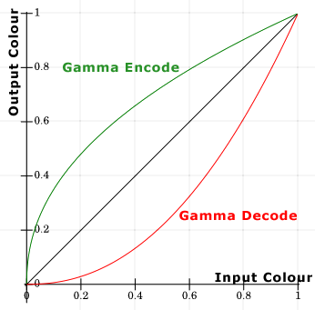
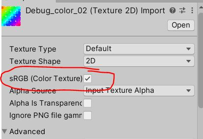

# Linear / Gamma

Unity에는 Gamma와 Linear를 선택할 수 있는 Color Space항목이 있다.

`Edit> Project Settings> Player> Other Settings> Rendering> Color Space`


## Gamma / Linear Color Space 결과물 차이

- [unity: Linear or gamma workflow](https://docs.unity3d.com/2021.1/Documentation/Manual/LinearRendering-LinearOrGammaWorkflow.html)


이러한 조명 강도, 블렌딩 차이는 어디서 오는 것일까?

## Gamma와 Linear의 관계

같은 RGB값이라도 Linear와 Gamma상태에서 보여지는 색이 다르다.


- 감마 보정([wiki: Gamma correction](https://en.wikipedia.org/w/index.php?title=Gamma_correction))

가운데 45도 선이 Linear(Gamma: 1.0)이며, 나머지는 감마 보정이다(위로는 Encode(0.45), 아레로는 Decode(2.2))



| Gamma correction | Gamma value  | 공간        |
|------------------|--------------|-------------|
| encode           | 0.45 (1/2.2) | sRGB        |
| -                | 1.0          | Linear      |
| decode           | 2.2          | Gamma / CRT |

- [wiki: sRGB](https://en.wikipedia.org/wiki/SRGB) : standard RGB color space.

## Gamma / Linear Color Space 작업 환경


### 감마 보정 환경

| 환경   | Gamma correction            | 설명                                     |
|--------|-----------------------------|------------------------------------------|
| 포토샵 | decode(2.2) -> encode(0.45) | 포토샵 기본셋팅: 편집(Gamma), 저장(sRGB) |
| 셰이더 | 1                           | 셰이더 계산은 Linear 환경이다            |

### Rendering - Gamma Color Space

| 환경   | 공간      | 설명                       |
|--------|-----------|----------------------------|
| 저장   | sRGB      | 포토샵 이미지 파일         |
| 셰이더 | Linear    | `sRGB`상태의 이미지 데이터 |
| 출력   | __Gamma__ | decode되어서 모니터에 출력 |

### Rendering - Linear Color Space

| 환경           | 공간       | 설명                         |
|----------------|------------|------------------------------|
| 저장           | sRGB       | 포토샵 이미지 파일           |
| __이미지옵션__ | -          | sRGB Check(Gamma decode적용) |
| 셰이더         | Linear     | `Gamma`상태의 이미지 데이터  |
| __변환__       | sRGB       | sRGB로 한번 변환이 된다      |
| 출력           | __Linear__ | decode되어서 모니터에 출력   |

## Linear Color Space에서 작업시 주의할 점

- 플렛폼 지원
- sRGB로 보정이 필요한 텍스쳐 구분
- UI 텍스쳐의 Alpha값

### 플렛폼 지원

- OpenGL ES 2.0 이하는 Gamma만 지원.
  - <https://blogs.unity3d.com/kr/2016/12/07/linear-rendering-support-on-android-and-ios/>
  - <https://developer.android.com/about/dashboards/index.html#OpenGL>

- Linear를 위한 모바일 최소 사양

| platform | version                                 | API                    |
|----------|-----------------------------------------|------------------------|
| Android  | Android 4.3 / API level 18 / Jelly Bean | OpenGL ES 3.0 / Vulkan |
| iOS      | 8.0                                     | Metal                  |

### sRGB로 보정이 필요한 텍스쳐 구분



1. 데이터를 그대로 다루는것은 Linear로
2. 나머지 Albedo / Emmission는 sRGB 체크로 Gamma Decode 하도록

| Image                      | sRGB     |                                        |
|----------------------------|----------|----------------------------------------|
| Albedo                     | O        | Gamma Decode 적용                      |
| Albedo + Smoothness(alpha) | O        | sRGB는 RGB값에만 적용. Alpha는 미적용. |
| DataTexture                | X        | 데이터 그대로 사용                     |
| NormalMap                  | 옵션없음 | 데이터 그대로 사용                     |

### UI 텍스쳐의 Alpha값

- Linear환경으로 보다 풍부한 표현력을 얻었지만, UI색상의 알파블랜딩이 제대로 되지 않는 현상이 있다.
  - Linear개념으로 보면 정확한 계산이지만, 포토샵 작업자 관점에서는 아니다.
- sRGB옵션은 RGB에만 영향을 줌으로, Alpha를 처리함에 있어 추가 작업을 해 주어야 한다.


몇가지 방법이 있다

- 포토샵 강제 설정하거나...
- UI카메라와 SRP의 활용하거나..

#### Photoshop 설정

- 처음부터 Linear로 저장시켜버리자
- Color Settings: Blend RPG Colors Using Gamma: 1.00
- 공수가 많이 든다... 디자이너들이 작업하기 불편...

#### UI카메라 + SRP

- UI카메라를 따로 두어서 UI Alpha에 미리 감마를 적용시켜주자.
- 그리고 Game카메라와 잘 섞어주자.

1. UITexture sRPG해제
   - sRGB상태 데이터 그대로 쓰고 Alpha만 어떻게 잘 처리할 것이다.
2. Main Camera
   1. Camera> Rendering> Culling Mask> Uncheck UI
3. UI Camera
   1. Camera> Render Type> OverLay
   2. Camera> Rendering> Renderer> GameUIFix
   3. Camera> Rendering> Culling Mask> UI
4. UI Canvas
   1. Canvas> Render Camera> UI Camera
5. PipelineAsset 설정
   1. _CameraColorTexture를 활용: Quality> Anti Aliasing (MSAA)> 2x 이상
6. RenderFeature 작성
   1. Game 카메라(Linear공간)를 Gamma 공간으로 변환
   2. 변환된 Game카메라의 출력결과 + UI카메라 출력결과
   3. 합친 결과(Gamma Space)를 Linear Space로 변경시켜주기
7. 새로운 Renderer 추가와 작성한 Feature추가
   1. General> Renderer List> Add Last GammaUIFix


``` hlsl
// _CameraColorTexture 활성화는 PipelineAsset> Quality> Anti Aliasing (MSAA)> 2x 이상으로 하면 됨.

// 1. DrawUIIntoRTPass
//    cmd.SetRenderTarget(UIRenderTargetID);
//    cmd.ClearRenderTarget(clearDepth: true, clearColor: true, Color.clear);
// 2. BlitPass
//    cmd.Blit(DrawUIIntoRTPass.UIRenderTargetID, _colorHandle, _material);

float4 uiColor = SAMPLE_TEXTURE2D(_MainTex, sampler_MainTex, i.uv);
uiColor.a = LinearToGamma22(uiColor.a);

float4 mainColor = SAMPLE_TEXTURE2D(_CameraColorTexture, sampler_CameraColorTexture, i.uv);
mainColor.rgb = LinearToGamma22(mainColor.rgb);

float4 finalColor;
finalColor.rgb = lerp(mainColor.rgb, uiColor.rgb, uiColor.a);
finalColor.rgb = Gamma22ToLinear(finalColor.rgb);
finalColor.a = 1;
```

## Ref

- [정종필 - Gamma Color space와 Linear Color space란?](https://www.youtube.com/watch?v=Xwlm5V-bnBc)
- [정종필 - 라이팅과 셰이더에서 연산을 위한 선형 파이프라인](https://www.youtube.com/watch?v=oVyqLhVrjhY)
- [정종필 - 유니티 셰이더에서 sRGB/Linear 사용 및 응용](https://www.youtube.com/watch?v=lUvsEfqOkUo)
- [GDCValue: Uncharted-2-HDR](https://www.gdcvault.com/play/1012351/Uncharted-2-HDR)
- [Lighting Shading by John Hable](https://www.slideshare.net/naughty_dog/lighting-shading-by-john-hable)
- [Article - Gamma and Linear Spaces](http://www.codinglabs.net/article_gamma_vs_linear.aspx)
- [[데브루키] Color space gamma correction](https://www.slideshare.net/agebreak/color-space-gamma-correction)
- [선형(Linear) 렌더링에서의 UI 작업할때 요령](https://chulin28ho.tistory.com/476)
- [201205 Unity Linear color space에서 UI의 alpha 값이 바뀌는 문제에 대하여..](https://illu.tistory.com/1430)
- [3D scene need Linear but UI need Gamma](https://cmwdexint.com/2019/05/30/3d-scene-need-linear-but-ui-need-gamma/)
- [1 - PBR Linear Workflow](https://forum.reallusion.com/308094/1-PBR-Linear-Workflow)
- [[Unity] Always Be Linear: Shader-Based Gamma Correction](https://medium.com/@abdulla.aldandarawy/unity-always-be-linear-1a30db4765db)
