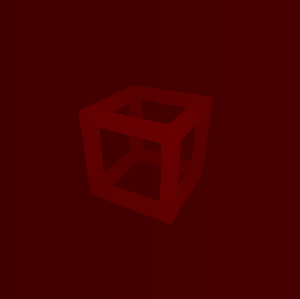

_CameraColorTexture

_CameraDepthNormalsTexture

_CameraDepthTexture

com.unity.render-pipelines.universal/ShaderLibrary/DeclareDepthTexture.hlsl
SampleSceneDepth
LoadSceneDepth

_CameraOpaqueTexture
com.unity.render-pipelines.universal/ShaderLibrary/DeclareOpaqueTexture.hlsl
SampleSceneColor
LoadSceneColor

_CameraNormalsTexture
SampleSceneNormals
LoadSceneNormals
com.unity.render-pipelines.universal/ShaderLibrary/DeclareNormalsTexture.hlsl